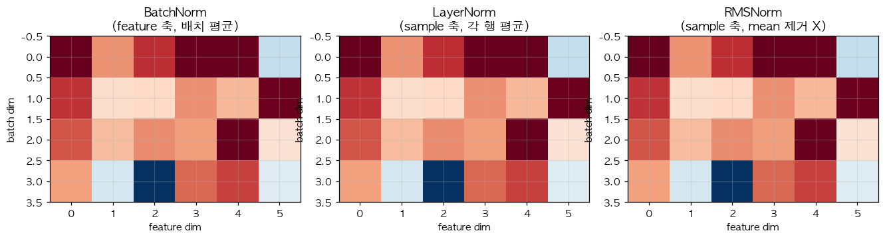

# 04. LayerNorm — Transformer 의 표준 정규화

> 📓 [원본 notebook](../solutions/04_layernorm_solution.ipynb) · 난이도 🟡

## 개념

Layer Normalization 은 각 **샘플** 의 feature 축에 대해 평균을 빼고 표준편차로 나눠, 출력의 분포를 안정화합니다.

$$\text{LayerNorm}(x) = \gamma \cdot \frac{x - \mu}{\sqrt{\sigma^2 + \epsilon}} + \beta$$

- $\mu, \sigma^2$: 마지막 차원에서 계산한 평균·분산
- $\gamma, \beta$: 학습 가능한 scale, shift (이렇게 안 해주면 모델이 아예 identity transform 을 표현할 수 없게 됨)
- $\epsilon$: 0-division 방지용 작은 수

**BatchNorm 과의 차이:** BN 은 배치 방향(샘플들 사이), LN 은 feature 방향(한 샘플 안에서). → Transformer 는 시퀀스 길이가 가변이라 BN 이 불안정 → LN 이 표준.



## 코드 line-by-line

```python
def my_layer_norm(x, gamma, beta, eps=1e-5):
    mean = x.mean(dim=-1, keepdim=True)
    var = x.var(dim=-1, keepdim=True, unbiased=False)
    x_norm = (x - mean) / torch.sqrt(var + eps)
    return gamma * x_norm + beta
```

| 라인 | 코드 | 설명 |
|------|------|------|
| 2 | `x.mean(dim=-1, keepdim=True)` | **마지막 축** (feature 축) 에서 평균. `keepdim=True` 로 `(..., 1)` shape 유지. |
| 3 | `x.var(..., unbiased=False)` | 분산. `unbiased=False` 는 $N$ 으로 나눔 (biased). PyTorch `F.layer_norm` 과 동일. 표본분산($N-1$)이 아니라는 점 주의. |
| 4 | `(x - mean) / torch.sqrt(var + eps)` | 표준화. `eps` 를 **분산에 더한 뒤** 제곱근을 취함 (표준편차에 더하면 의미가 달라짐). |
| 5 | `gamma * x_norm + beta` | affine 변환. broadcast 로 마지막 축에 적용. 학습을 통해 모델이 필요하면 다시 원래 분포로 되돌릴 수 있는 **자유도** 제공. |

## 왜 마지막 축만 정규화?

- Transformer 의 `x` shape 은 보통 `(B, S, D)`.
- LN 은 각 토큰마다 feature 축 D 에서만 통계를 냄.
- 배치 B, 시퀀스 S 에 의존하지 않음 → **시퀀스 길이 변해도 통계 변화 없음**.

## 검증

```python
x = torch.randn(2, 8)
gamma = torch.ones(8)
beta = torch.zeros(8)
out = my_layer_norm(x, gamma, beta)
ref = torch.nn.functional.layer_norm(x, [8], gamma, beta)
print("Match ref?", torch.allclose(out, ref, atol=1e-4))  # True
```

정규화 후 각 행(샘플) 의 평균은 0, 표준편차는 1 에 가까워집니다.

## 수치 디테일

- `eps` 는 **variance 에 더해지는 값**. 원래 논문과 PyTorch 는 이 방식.
- `unbiased=False` (즉 $\text{Var} = \frac{1}{N}\sum(x_i-\mu)^2$) 을 써야 `torch.nn.functional.layer_norm` 과 일치.

## 한 걸음 더

- **RMSNorm** ([08번](08_rmsnorm.md)) 은 mean 을 빼는 단계를 생략해 더 간단하고 빠름 (LLaMA 등 최신 LLM).
- **BatchNorm** ([07번](07_batchnorm.md)) 과 비교하면 LN 은 eval 모드에서도 항상 같은 계산.
- Pre-norm vs post-norm: 최근 Transformer 는 `x + f(LN(x))` (pre-norm) 을 선호. 학습 안정성 차이.
