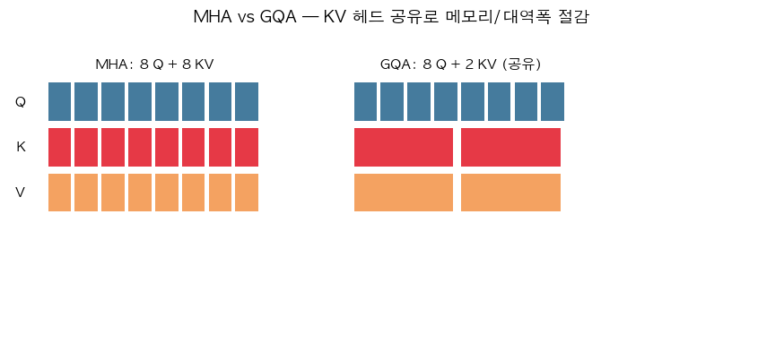

# 10. Grouped Query Attention (GQA) — KV 헤드 공유

> 📓 [원본 notebook](../solutions/10_gqa_solution.ipynb) · 난이도 🔴

## 개념

MHA 에서는 Q, K, V 모두 `num_heads` 개의 head 를 가집니다. **문제**: 추론 시 KV cache 가 커지면 **메모리 대역폭**이 병목. 모든 head 의 K, V 를 매번 GPU 로 로드해야 함.

**GQA**: Query head 는 많게 유지(표현력), **K/V head 는 적게** 해서 여러 Q 가 같은 K/V 를 공유. → cache 메모리/대역폭 대폭 감소, 품질 하락 미미.

- Q heads: `num_heads = H`
- KV heads: `num_kv_heads = G` (보통 H/4, H/8)
- 각 KV head 를 `H/G` 개의 Q 가 공유

$H = G$ 이면 일반 MHA, $G = 1$ 이면 **Multi-Query Attention (MQA)**.



## 코드 line-by-line

```python
class GroupQueryAttention:
    def __init__(self, d_model, num_heads, num_kv_heads):
        self.num_heads = num_heads
        self.num_kv_heads = num_kv_heads
        self.d_k = d_model // num_heads
        self.W_q = nn.Linear(d_model, d_model)
        self.W_k = nn.Linear(d_model, num_kv_heads * self.d_k)
        self.W_v = nn.Linear(d_model, num_kv_heads * self.d_k)
        self.W_o = nn.Linear(d_model, d_model)
```

| 라인 | 설명 |
|------|------|
| 6 | `W_q` 는 그대로 `d_model → d_model` (H × d_k) |
| 7-8 | **`W_k`, `W_v` 출력 차원이 작음**: `num_kv_heads × d_k`. 이게 파라미터 절감의 핵심. |

```python
    def forward(self, x):
        B, S, _ = x.shape
        q = self.W_q(x).view(B, S, self.num_heads, self.d_k).transpose(1, 2)
        k = self.W_k(x).view(B, S, self.num_kv_heads, self.d_k).transpose(1, 2)
        v = self.W_v(x).view(B, S, self.num_kv_heads, self.d_k).transpose(1, 2)
```

- `q.shape = (B, H, S, d_k)`
- `k.shape = (B, G, S, d_k)` — 더 적은 head

```python
        repeats = self.num_heads // self.num_kv_heads
        k = k.repeat_interleave(repeats, dim=1)
        v = v.repeat_interleave(repeats, dim=1)
```

| 코드 | 설명 |
|------|------|
| `repeats = H // G` | 한 KV head 를 몇 개의 Q head 가 공유하는지. |
| `repeat_interleave(repeats, dim=1)` | head 축을 복제. 예: `[k0, k1]` 를 `repeats=3` 으로 → `[k0, k0, k0, k1, k1, k1]`. shape `(B, H, S, d_k)` 로 확장. |

이 단계는 **개념적**인 복제이며, 실제 고성능 구현은 kernel 내부에서 broadcast 로 처리해 메모리를 늘리지 않습니다. 이 코드는 이해하기 쉬운 레퍼런스입니다.

```python
        scores = torch.matmul(q, k.transpose(-2, -1)) / math.sqrt(self.d_k)
        weights = torch.softmax(scores, dim=-1)
        attn = torch.matmul(weights, v)
        out = attn.transpose(1, 2).contiguous().view(B, S, -1)
        return self.W_o(out)
```

나머지는 [MHA (06번)](06_multihead_attention.md) 과 동일.

## 메모리 절감

`d_model = 4096`, `H = 32`, `d_k = 128` 기준:

| 방식 | K 크기 per token | cache 메모리 (S=8192) |
|------|------------------|-----------------------|
| MHA (G=32) | 32 × 128 = 4096 | 32 MB / layer |
| GQA (G=8) | 8 × 128 = 1024 | 8 MB / layer |
| MQA (G=1) | 128 | 1 MB / layer |

32 레이어 모델이면 MHA 대비 GQA(G=8) 는 **4배 cache 감소**.

## 한 걸음 더

- LLaMA-2, Mistral 등이 GQA 채택
- [KV Cache (14번)](14_kv_cache.md) 와 결합 시 효과 극대화
- 품질 저하 vs 속도 trade-off: 논문 상 `G = H/8` 정도까지는 성능 손실 거의 없음
