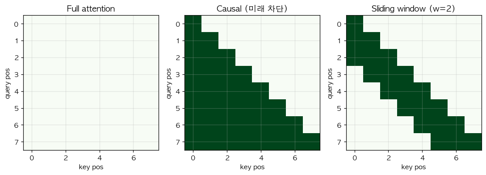

# 11. Sliding Window Attention — 인접 토큰만 본다

> 📓 [원본 notebook](../solutions/11_sliding_window_solution.ipynb) · 난이도 🔴

## 개념

Full attention 은 $O(S^2)$ 이라 긴 문서에 비쌉니다. **Sliding window** 는 각 query 가 **±w 범위 안의 key** 만 보게 제한해 복잡도를 $O(Sw)$ 로 낮춥니다.

$$\text{mask}_{ij} = \begin{cases} 0 & |i-j| \le w \\ -\infty & |i-j| > w \end{cases}$$

Mistral 7B 등이 이 방식을 사용. 멀리 떨어진 의존성은 여러 layer 를 쌓으면 점진적으로 전달됨 (receptive field 확장).



## 코드 line-by-line

```python
def sliding_window_attention(Q, K, V, window_size):
    d_k = K.size(-1)
    scores = torch.bmm(Q, K.transpose(1, 2)) / math.sqrt(d_k)
    S = Q.size(1)
    idx = torch.arange(S, device=Q.device)
    mask = (idx.unsqueeze(0) - idx.unsqueeze(1)).abs() > window_size
    scores = scores.masked_fill(mask.unsqueeze(0), float('-inf'))
    weights = torch.softmax(scores, dim=-1)
    return torch.bmm(weights, V)
```

| 라인 | 코드 | 설명 |
|------|------|------|
| 2-3 | 기본 attention score |
| 4 | `idx = torch.arange(S)` | `[0, 1, 2, ..., S-1]` |
| 5 | `idx.unsqueeze(0)` shape `(1, S)`, `idx.unsqueeze(1)` shape `(S, 1)` | broadcast 로 `(S, S)` 의 거리 행렬 `idx[j] - idx[i]` 생성 |
|   | `.abs() > window_size` | 거리가 window 를 벗어나는 곳을 True 로 |
| 6 | `.masked_fill(mask.unsqueeze(0), -inf)` | 배치 축 broadcast. 벗어난 위치 score → -inf |

## 거리 행렬이 어떻게 만들어지는가

`S=4` 예시:

```
idx.unsqueeze(0) = [[0, 1, 2, 3]]              # (1, 4)
idx.unsqueeze(1) = [[0], [1], [2], [3]]        # (4, 1)

차이 행렬 (broadcast):
[[ 0,  1,  2,  3],    # row 0: 각 col 과의 거리
 [-1,  0,  1,  2],    # row 1
 [-2, -1,  0,  1],
 [-3, -2, -1,  0]]

.abs() > 1 (window=1):
[[F, F, T, T],
 [F, F, F, T],
 [T, F, F, F],
 [T, T, F, F]]
```

정확히 **band** 모양이 됩니다.

## `window_size=0` 특이 케이스

`|i-j| > 0` 이면 mask → 자기 자신만 봄. softmax 는 단일 값에 1 을 반환 → `out = V`.

```python
sliding_window_attention(Q, K, V, window_size=0)  # ≈ V
```

## 한 걸음 더

- **Causal + sliding** 을 함께: `((i - j) < 0) | ((i - j) > w)` 식으로 마스크 조합
- Mistral 은 **윈도우 + 글로벌 토큰** 혼합을 쓰기도 함
- Longformer: 일부 토큰은 full attention, 나머지는 sliding
