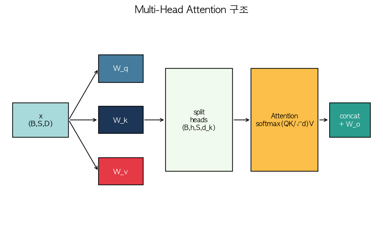

# 13. GPT-2 Transformer Block — 모든 것의 집합

> 📓 [원본 notebook](../solutions/13_gpt2_block_solution.ipynb) · 난이도 🔴

## 개념

**GPT-2 의 기본 단위** — 하나의 transformer 디코더 블록. 지금까지의 여러 부품을 모두 엮습니다:

1. **Pre-norm**: LN 이 residual branch 앞에
2. **Causal multi-head self-attention** ([06번](06_multihead_attention.md), [09번](09_causal_attention.md))
3. **MLP with GELU**: 4× 확장 → 4× 축소 ([19번](19_gelu.md))
4. **Residual connection** 두 개

```
x ──▶ LN ──▶ CausalMHA ──▶ (+) ──▶ LN ──▶ MLP ──▶ (+) ──▶
 └──────────────────────────┘ └──────────────────┘
       residual 1                  residual 2
```



## 코드 line-by-line

### `__init__`

```python
class GPT2Block(nn.Module):
    def __init__(self, d_model, num_heads):
        super().__init__()
        self.num_heads = num_heads
        self.d_k = d_model // num_heads

        self.ln1 = nn.LayerNorm(d_model)
        self.ln2 = nn.LayerNorm(d_model)

        self.W_q = nn.Linear(d_model, d_model)
        self.W_k = nn.Linear(d_model, d_model)
        self.W_v = nn.Linear(d_model, d_model)
        self.W_o = nn.Linear(d_model, d_model)

        self.mlp = nn.Sequential(
            nn.Linear(d_model, 4 * d_model),
            nn.GELU(),
            nn.Linear(4 * d_model, d_model),
        )
```

| 부품 | 설명 |
|------|------|
| `ln1, ln2` | attention/MLP 직전에 적용되는 LayerNorm (**pre-norm**) |
| `W_q,k,v,o` | multi-head attention 의 projection 들 |
| `mlp` | Position-wise feed-forward. **`4×`** 는 관례. 예: d=768 → 내부 3072 |
| `GELU` | 부드러운 ReLU ([19번](19_gelu.md)) |

### `_attn` (causal multi-head)

```python
    def _attn(self, x):
        B, S, _ = x.shape
        q = self.W_q(x).view(B, S, self.num_heads, self.d_k).transpose(1, 2)
        k = self.W_k(x).view(B, S, self.num_heads, self.d_k).transpose(1, 2)
        v = self.W_v(x).view(B, S, self.num_heads, self.d_k).transpose(1, 2)
        scores = torch.matmul(q, k.transpose(-2, -1)) / math.sqrt(self.d_k)
        mask = torch.triu(torch.ones(S, S, device=x.device, dtype=torch.bool),
                          diagonal=1)
        scores = scores.masked_fill(mask, float('-inf'))
        weights = torch.softmax(scores, dim=-1)
        attn = torch.matmul(weights, v)
        return self.W_o(attn.transpose(1, 2).contiguous().view(B, S, -1))
```

정확히 [06번 MHA](06_multihead_attention.md) + [09번 causal mask](09_causal_attention.md) 를 합친 것. 별도 설명 생략.

### `forward` (residual 구조)

```python
    def forward(self, x):
        x = x + self._attn(self.ln1(x))
        x = x + self.mlp(self.ln2(x))
        return x
```

| 라인 | 설명 |
|------|------|
| `self.ln1(x)` | attention **앞** 에서 정규화 (pre-norm). post-norm 보다 학습 안정. |
| `self._attn(...)` | 정규화된 입력으로 attention |
| `x + ...` | **residual 연결** — 기울기 잘 흐름, 깊은 모델 학습 가능 |
| 두 번째 라인도 동일 | MLP 에 같은 패턴 |

## Pre-norm vs Post-norm

- **Post-norm (원래 Transformer)**: `LN(x + f(x))`
- **Pre-norm (GPT-2 이후)**: `x + f(LN(x))`

Post-norm 은 residual 에 LN 이 끼어 기울기가 작아져 깊게 쌓기 어려움. Pre-norm 은 residual 경로가 clean 하게 유지되어 수렴 안정.

## 파라미터 수 (d_model=64, heads=4)

- Attention: 4 × (64×64 + 64) ≈ 16,640
- MLP: 64×256 + 256 + 256×64 + 64 ≈ 33,152
- LN × 2: 2 × 128 = 256
- **합계**: 약 50K

MLP 가 attention 보다 파라미터가 많은 게 **일반적**.

## 한 걸음 더

- **KV cache** 로 생성 가속 → [14번](14_kv_cache.md)
- **RMSNorm + SwiGLU MLP** 조합 = LLaMA 스타일 → [08번](08_rmsnorm.md), [15번](15_mlp.md)
- **RoPE** 로 position 주입 → [24번](24_rope.md)
