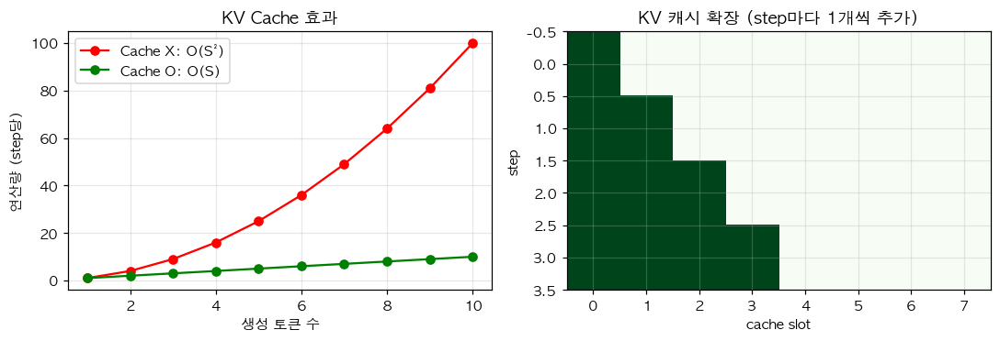

# 14. KV Cache — 자동회귀 생성을 $O(S^2) \to O(S)$ 로

> 📓 [원본 notebook](../solutions/14_kv_cache_solution.ipynb) · 난이도 🔴

## 개념

Causal self-attention 에서 새 토큰을 하나 생성할 때, **과거 토큰의 K, V 는 바뀌지 않습니다**. 매번 전체 시퀀스의 K, V 를 다시 계산하는 건 낭비.

→ 과거의 K, V 를 **캐시에 저장**하고, 새 토큰 하나만 계산해 **append**. 매 step 연산량 $O(S) \to O(1)$. 전체는 $O(S^2) \to O(S)$.



## 코드 line-by-line

```python
class KVCacheAttention(nn.Module):
    def __init__(self, d_model, num_heads):
        super().__init__()
        self.num_heads = num_heads
        self.d_k = d_model // num_heads
        self.W_q = nn.Linear(d_model, d_model)
        self.W_k = nn.Linear(d_model, d_model)
        self.W_v = nn.Linear(d_model, d_model)
        self.W_o = nn.Linear(d_model, d_model)
```

MHA 와 동일한 `__init__`.

### `forward` — 핵심

```python
    def forward(self, x, cache=None):
        B, S_new, _ = x.shape
        q = self.W_q(x).view(B, S_new, self.num_heads, self.d_k).transpose(1, 2)
        k = self.W_k(x).view(B, S_new, self.num_heads, self.d_k).transpose(1, 2)
        v = self.W_v(x).view(B, S_new, self.num_heads, self.d_k).transpose(1, 2)
```

`S_new` 는 **이번에 들어온** 토큰 수. 디코딩 중이면 1, 프리필(최초 prompt 처리) 이면 prompt 길이.

```python
        if cache is not None:
            k = torch.cat([cache[0], k], dim=2)
            v = torch.cat([cache[1], v], dim=2)

        new_cache = (k, v)
        S_total = k.shape[2]
```

| 코드 | 설명 |
|------|------|
| `cache = (K_past, V_past)` | 이전 step 까지 쌓아온 K, V. shape `(B, h, S_past, d_k)`. |
| `torch.cat([..., ...], dim=2)` | **시퀀스 축** 으로 이어붙임. |
| `new_cache` | 다음 step 에 돌려줄 업데이트된 cache |
| `S_total` | `S_past + S_new` |

```python
        scores = torch.matmul(q, k.transpose(-2, -1)) / math.sqrt(self.d_k)
```

`q.shape = (B, h, S_new, d_k)`, `k.shape = (B, h, S_total, d_k)` → scores `(B, h, S_new, S_total)`. **새 토큰만 query, 전체가 key**.

```python
        if S_new > 1:
            S_past = S_total - S_new
            mask = torch.triu(
                torch.ones(S_new, S_total, device=x.device, dtype=torch.bool),
                diagonal=S_past + 1,
            )
            scores = scores.masked_fill(mask, float('-inf'))
```

**Prefill 단계** (prompt 여러 토큰 동시 처리) 에서는 causal mask 필요:

- `S_new > 1` 인 경우, 각 query $i$ 는 **전체 시퀀스 위치 $S_{past} + i$** 에 해당
- Key 위치 $j$ 를 볼 수 있는 조건: $j \le S_{past} + i$ → 상삼각 `diagonal=S_past + 1`

**Decode 단계** (한 번에 토큰 1 개) 는 `S_new = 1` 이라 mask 불필요 — 새 토큰은 자기 포함 모든 과거를 볼 수 있음.

```python
        weights = torch.softmax(scores, dim=-1)
        attn = torch.matmul(weights, v)
        out = self.W_o(attn.transpose(1, 2).contiguous().view(B, S_new, -1))
        return out, new_cache
```

- `attn.shape = (B, h, S_new, d_k)` — **S_new 행만** 출력
- 출력과 함께 **다음 호출용 cache** 반환

## 사용 예

```python
attn = KVCacheAttention(d_model=64, num_heads=4)
x = torch.randn(1, 6, 64)

# 방법 1: 한 번에 전체 처리
full_out, _ = attn(x)

# 방법 2: 나눠서 (prefill 4 + decode 1 + decode 1)
out1, cache = attn(x[:, :4])         # prefill
out2, cache = attn(x[:, 4:5], cache)  # decode step 1
out3, cache = attn(x[:, 5:6], cache)  # decode step 2
inc_out = torch.cat([out1, out2, out3], dim=1)

assert torch.allclose(full_out, inc_out, atol=1e-5)  # 동일 결과
```

**두 방법의 결과가 정확히 같아야** cache 가 올바릅니다.

## 성능 효과

- Without cache: step $t$ 마다 $O(t^2)$ — 전체 $O(S^3)$
- With cache: step $t$ 마다 $O(t)$ — 전체 $O(S^2)$
- 대규모 LLM 추론에서 **실질적 속도 = KV cache 관리 최적화**

## 메모리 이슈

`cache[0]` shape = `(B, h, S, d_k)`. 배치 크고 컨텍스트 길면 **GB 단위** 메모리. → [GQA (10번)](10_gqa.md) 으로 h 축 줄여 메모리 절약.

## 한 걸음 더

- **Paged attention (vLLM)**: cache 를 페이지로 관리해 메모리 단편화 해결
- **Sliding window attention** ([11번](11_sliding_window.md)) 과 조합 시 cache 도 고정 크기 유지
- **Speculative decoding** ([34번](34_speculative_decoding.md)) 로 step 수 줄이기
