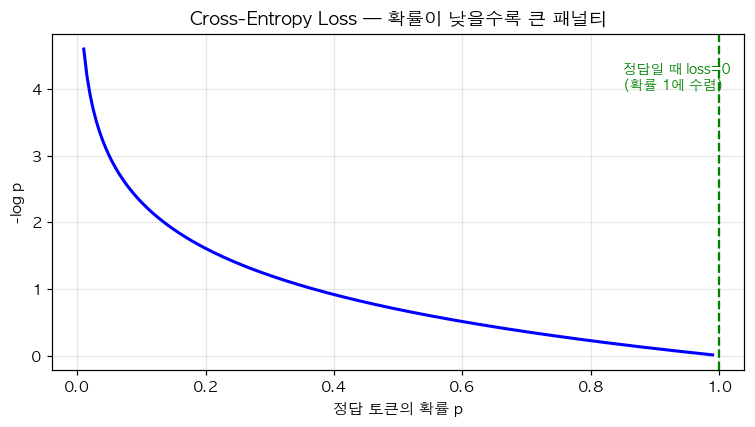

# 16. Cross-Entropy Loss — 분류/LM 의 표준 손실

> 📓 [원본 notebook](../solutions/16_cross_entropy_solution.ipynb) · 난이도 🟢

## 개념

분류(또는 언어 모델의 토큰 예측) 에서 가장 많이 쓰는 손실함수:

$$\mathcal{L} = -\frac{1}{N}\sum_{i=1}^N \log p_{y_i}(\text{logits}_i)$$

즉 "정답 클래스의 확률에 $-\log$ 를 취한 값의 평균". 정답 확률이 1 에 가까우면 loss≈0, 0 에 가까우면 loss→∞.



## 수치 안정한 구현

직접 `softmax → log → index` 를 하면 수치 불안정. **log-sum-exp 트릭**:

$$\log p_y = \text{logit}_y - \log\sum_j e^{\text{logit}_j} = \text{logit}_y - \text{LSE}(\text{logits})$$

## 코드 line-by-line

```python
def cross_entropy_loss(logits, targets):
    log_probs = logits - torch.logsumexp(logits, dim=-1, keepdim=True)
    return -log_probs[torch.arange(targets.shape[0]), targets].mean()
```

| 라인 | 코드 | 설명 |
|------|------|------|
| 2 | `torch.logsumexp(logits, dim=-1, keepdim=True)` | `log Σ exp(logits)` 을 수치 안정하게. 내부적으로 max 를 빼고 exp 해 overflow 방지. |
|   | `logits - logsumexp(...)` | **log_softmax** 와 동일. `(N, C)` shape 유지. |
| 3 | `log_probs[torch.arange(N), targets]` | **advanced indexing**. 각 행 `i` 에서 `targets[i]` 번째 원소만 골라 `(N,)` vector. |
|   | `-(...).mean()` | 음수 + 평균. 배치에 걸친 평균 loss. |

## Advanced indexing 상세

```python
log_probs.shape = (4, 10)
targets = torch.tensor([2, 5, 1, 8])
torch.arange(4) = [0, 1, 2, 3]

log_probs[[0,1,2,3], [2,5,1,8]]
= [log_probs[0,2], log_probs[1,5], log_probs[2,1], log_probs[3,8]]
```

즉 각 샘플 행에서 정답 열 하나씩만 뽑아낸 `(N,)` 텐서.

## PyTorch 레퍼런스와 비교

```python
torch.nn.functional.cross_entropy(logits, targets)
```

내부적으로 정확히 같은 계산. 단, 구현 디테일:
- 메모리 효율을 위해 log_softmax 대신 직접 LSE 계산
- `ignore_index` 지원
- `label_smoothing`, `weight` 옵션

## 검증

```python
logits = torch.randn(4, 10)
targets = torch.randint(0, 10, (4,))
print(cross_entropy_loss(logits, targets).item())
print(torch.nn.functional.cross_entropy(logits, targets).item())
# 두 값 일치
```

## 기울기 직관

Loss 의 logit 에 대한 기울기는:

$$\frac{\partial \mathcal{L}}{\partial \text{logit}_j} = p_j - \mathbb{1}[j = y]$$

즉 "예측 확률 - 원-핫 정답". 이 아름다운 형태가 softmax + cross-entropy 를 함께 쓰는 큰 이유.

## 한 걸음 더

- **Label smoothing**: 정답을 $1 - \alpha$, 나머지를 $\alpha/(C-1)$ 로 해 과신 방지
- **Focal loss**: 잘 맞히는 예시의 기여도를 줄임 (클래스 불균형)
- 언어 모델에서는 각 토큰 위치마다 cross-entropy 를 구한 뒤 평균
