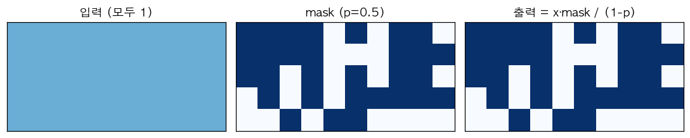

# 17. Dropout — 랜덤하게 "꺼서" 과적합 방지

> 📓 [원본 notebook](../solutions/17_dropout_solution.ipynb) · 난이도 🟢

## 개념

학습 시에 각 뉴런을 확률 $p$ 로 랜덤하게 0 으로 만들고, 살아남은 뉴런을 $1/(1-p)$ 로 scaling 합니다.

- **Training**: $y = \frac{x \odot m}{1-p}$, $m_i \sim \text{Bernoulli}(1-p)$
- **Inference**: $y = x$ (그대로)



**왜 효과적인가**: 매 step 다른 sub-network 가 학습되는 앙상블 효과 → 과적합 감소.

**왜 scaling 하는가 (inverted dropout)**: train/inference 간 **기댓값**을 같게 유지. $\mathbb{E}[m/(1-p)] = 1$. 반대로 학습에 scaling 안 하면 추론 시 $\times (1-p)$ 해야 하는데 실수하기 쉬움.

## 코드 line-by-line

```python
class MyDropout(nn.Module):
    def __init__(self, p=0.5):
        super().__init__()
        self.p = p

    def forward(self, x):
        if not self.training or self.p == 0:
            return x
        mask = (torch.rand_like(x) > self.p).float()
        return x * mask / (1 - self.p)
```

| 라인 | 코드 | 설명 |
|------|------|------|
| 7 | `self.training` | `nn.Module` 의 속성. `.train()` / `.eval()` 로 전환. |
|   | `if not self.training or self.p == 0` | 추론 모드거나 p=0 이면 dropout 없이 그대로 반환. |
| 9 | `torch.rand_like(x)` | `x` 와 같은 shape 의 `U(0, 1)` 난수. 매 호출 새로 샘플링. |
|   | `> self.p` | 확률 `1 - p` 로 `True` 인 boolean mask. |
|   | `.float()` | True=1, False=0 으로 변환. |
| 10 | `x * mask / (1 - self.p)` | 원소별 곱 + scaling (inverted dropout). |

## Train vs Eval 예시

```python
d = MyDropout(p=0.5)

d.train()
d(torch.ones(10))   # 약 절반은 0, 나머지는 2.0 (scaling)

d.eval()
d(torch.ones(10))   # 모두 1.0 그대로
```

`.train()` / `.eval()` 를 잊으면 배포 시 랜덤 결과가 나오는 버그가 생김 — Transformer 추론 코드에서 가장 흔한 실수 중 하나.

## 왜 `rand_like(x) > p` 인가?

- `rand_like(x) < p` → 확률 `p` 로 True → **그것을 0 으로** 만들려면 `mask = rand < p` 에서 `~mask` 를 곱해야 함
- `rand_like(x) > p` → 확률 `1 - p` 로 True → **그대로 곱하면 p 의 확률로 0**

코드는 후자 방식이라 더 직관적 (`mask=1` 이면 살아남음).

## 한 걸음 더

- **Attention dropout**: softmax 출력에 dropout
- **Residual dropout**: 각 residual branch 끝에 dropout
- **DropPath (stochastic depth)**: residual 전체를 확률적으로 건너뜀. ViT 에서 자주 씀
- 최근 대형 LLM 은 dropout 없이 대량 데이터 + 정규화로 대체
