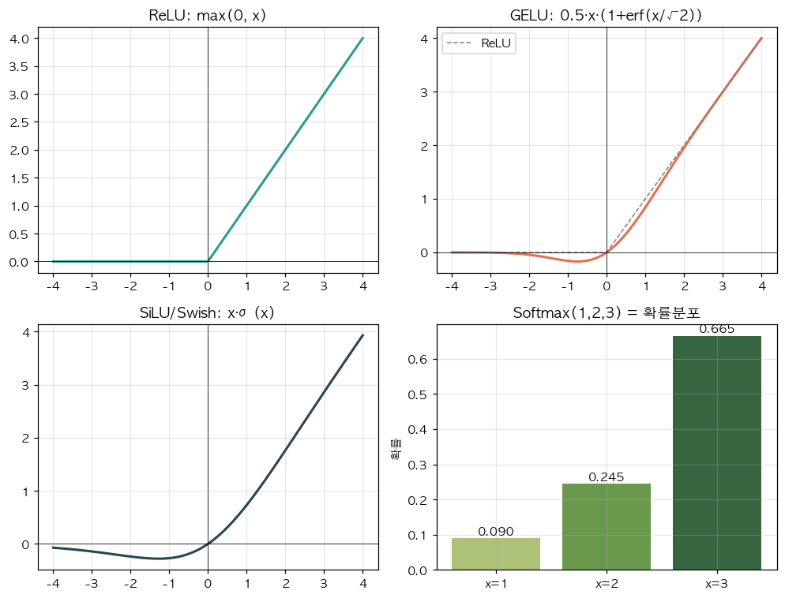

# 19. GELU — 부드러운 ReLU

> 📓 [원본 notebook](../solutions/19_gelu_solution.ipynb) · 난이도 🟢

## 개념

**GELU (Gaussian Error Linear Unit)** 는 표준 정규 CDF 로 ReLU 를 부드럽게 만든 활성화:

$$\text{GELU}(x) = x \cdot \Phi(x) = \frac{1}{2} x \left[1 + \text{erf}\!\left(\frac{x}{\sqrt{2}}\right)\right]$$

- $\Phi(x)$: 표준 정규분포 CDF — "x 가 양수일 확률" 같은 느낌
- 음수 영역에서도 **작은 기울기** → dead neuron 문제 완화
- 0 근처에서 부드럽게 휘어짐

BERT, GPT 계열의 표준. SiLU 와 매우 비슷한 모양.



## 코드 line-by-line

```python
def my_gelu(x):
    return 0.5 * x * (1.0 + torch.erf(x / math.sqrt(2.0)))
```

| 부분 | 설명 |
|------|------|
| `torch.erf(x / math.sqrt(2.0))` | **오차 함수** $\text{erf}$. $\Phi(x) = \frac{1}{2}(1 + \text{erf}(x/\sqrt{2}))$ 관계. |
| `1.0 + erf(...)` | `2·Φ(x)`. 0.5 배와 합쳐 정확한 $\Phi(x)$. |
| `0.5 * x * ...` | 수식 전개: $x \cdot \Phi(x)$. |

## Tanh 근사 버전

원래 BERT 코드에서 쓰인 빠른 근사:

$$\text{GELU}_\text{tanh}(x) \approx 0.5 x \left(1 + \tanh\!\left(\sqrt{2/\pi}(x + 0.044715 x^3)\right)\right)$$

```python
def gelu_tanh(x):
    return 0.5 * x * (1 + torch.tanh(math.sqrt(2/math.pi) * (x + 0.044715 * x**3)))
```

예전에는 `erf` 가 느려서 이 근사를 썼지만, 최신 GPU 에서는 `erf` 가 빠릅니다. 둘 다 `F.gelu` 의 옵션.

## ReLU / GELU / SiLU 비교

| 활성화 | 수식 | 특징 |
|--------|------|------|
| ReLU | $\max(0, x)$ | 단순, dead neuron |
| GELU | $x \Phi(x)$ | 부드러움, BERT/GPT 표준 |
| SiLU | $x \sigma(x)$ | GELU 와 거의 동일, 더 간단 |

## 기울기

$$\frac{d}{dx} \text{GELU}(x) = \Phi(x) + x \phi(x)$$

여기서 $\phi$ 는 표준정규 PDF. 음수 큰 영역에서도 완전히 0 이 아님 → gradient flow 유지.

## 검증

```python
x = torch.tensor([-2., -1., 0., 1., 2.])
print(my_gelu(x))
# tensor([-0.0454, -0.1587, 0.0000, 0.8413, 1.9546])
print(F.gelu(x))
# 동일
```

## 한 걸음 더

- Transformer MLP 에서 가장 흔함 → [GPT-2 Block (13번)](13_gpt2_block.md)
- [SwiGLU (15번)](15_mlp.md) 는 SiLU 기반 gated MLP — 최신 LLM 선호
