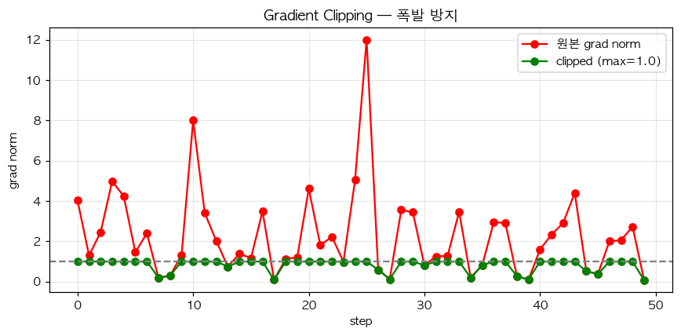

# 21. Gradient Clipping — 기울기 폭발 막기

> 📓 [원본 notebook](../solutions/21_gradient_clipping_solution.ipynb) · 난이도 🟢

## 개념

RNN, 긴 시퀀스 Transformer, 낮은 precision 학습에서 **기울기가 순간적으로 폭발**하면 한 번의 step 으로 모델이 망가질 수 있습니다. 모든 파라미터의 gradient 를 **하나의 벡터**로 이어붙여 그 **전체 norm** 이 `max_norm` 을 넘으면 비율로 줄입니다:

$$g' = g \cdot \min\!\left(1, \frac{\text{max\_norm}}{\|g\|_2}\right)$$

방향은 유지하고 크기만 제한. LLM 학습의 사실상 표준.



## 코드 line-by-line

```python
def clip_grad_norm(parameters, max_norm):
    parameters = [p for p in parameters if p.grad is not None]
    total_norm = torch.sqrt(sum(p.grad.norm() ** 2 for p in parameters))
    clip_coef = max_norm / (total_norm + 1e-6)
    if clip_coef < 1:
        for p in parameters:
            p.grad.mul_(clip_coef)
    return total_norm.item()
```

| 라인 | 코드 | 설명 |
|------|------|------|
| 2 | grad 이 `None` 인 파라미터 제외 (`freeze` 된 것) |
| 3 | `p.grad.norm()` | 각 tensor 의 L2 norm (Frobenius = 벡터화 L2 와 동일) |
|   | `** 2` 후 sum, sqrt | 전체를 하나의 벡터로 본 **global L2 norm**. 각 텐서 norm 제곱의 합의 제곱근. |
| 4 | `max_norm / (total + 1e-6)` | 줄일 비율. `1e-6` 은 0-division 방지. |
| 5-7 | `< 1` 일 때만 적용 | 이미 작은 gradient 는 그대로. 키우면 안 됨. |
|    | `.mul_(clip_coef)` | **in-place** 곱. 파라미터를 가리키는 grad 를 직접 수정. |

## 왜 norm 을 **합쳐서** 계산하는가

파라미터별로 독립 clip 하면 방향이 왜곡됩니다. 전체를 한 벡터로 보고 같은 비율로 줄여야 **방향 보존**.

## `torch.nn.utils.clip_grad_norm_` 과 비교

```python
torch.nn.utils.clip_grad_norm_(params, max_norm=1.0, norm_type=2.0)
```

- 반환값: **clip 전** total_norm (본 구현과 동일)
- `norm_type` 으로 L∞ (inf) 도 가능

## 사용 패턴

```python
for x, y in loader:
    optimizer.zero_grad()
    loss = criterion(model(x), y)
    loss.backward()
    torch.nn.utils.clip_grad_norm_(model.parameters(), max_norm=1.0)
    optimizer.step()
```

**반드시 `backward()` 후, `step()` 전** 에 호출.

## Typical `max_norm` 값

- Transformer: 1.0 이 관례
- RNN/LSTM: 5.0
- 값이 너무 작으면 학습이 느려지고, 너무 크면 폭발 방지 효과 약함

## 한 걸음 더

- **Gradient value clipping**: 원소별 `clip(-c, c)` — norm clipping 보다 덜 선호
- **Adaptive clip**: 최근 step 의 norm 평균 기반으로 자동 조정
- FP16 학습에서는 clip 을 unscale 후 (loss scaler) 수행
