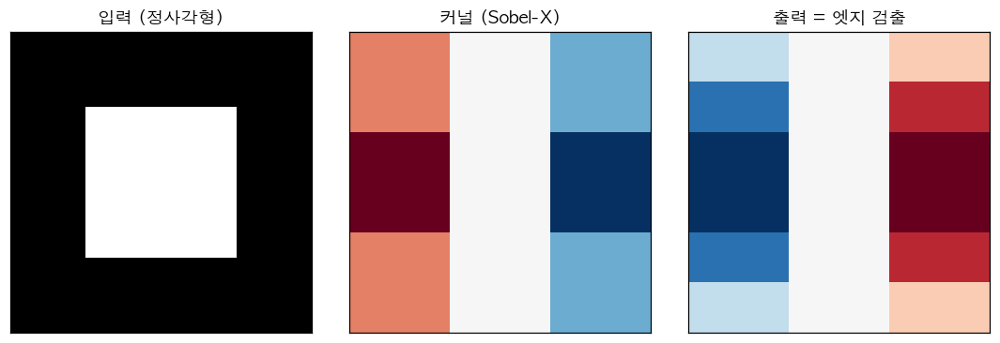

# 22. 2D Convolution — CNN 의 기초 연산

> 📓 [원본 notebook](../solutions/22_conv2d_solution.ipynb) · 난이도 🟡

## 개념

합성곱(Convolution) 은 입력 이미지 위로 **커널** 을 슬라이딩하며, 각 위치에서 내적을 수행합니다. 결과 이미지가 feature map 입니다.

- 입력: `(B, C_in, H, W)`
- 커널: `(C_out, C_in, kH, kW)`
- 출력: `(B, C_out, H_out, W_out)` — `H_out = (H + 2p - kH) / s + 1`



## 코드 line-by-line

```python
def my_conv2d(x, weight, bias=None, stride=1, padding=0):
    if padding > 0:
        x = F.pad(x, [padding] * 4)
    B, C_in, H, W = x.shape
    C_out, _, kH, kW = weight.shape
    H_out = (H - kH) // stride + 1
    W_out = (W - kW) // stride + 1
    patches = x.unfold(2, kH, stride).unfold(3, kW, stride)
    out = torch.einsum('bihwjk,oijk->bohw', patches, weight)
    if bias is not None:
        out = out + bias.view(1, -1, 1, 1)
    return out
```

### 1. Padding

```python
x = F.pad(x, [padding]*4)
```

`[left, right, top, bottom]` 순서로 4방향 0-padding. 입력 공간 확장.

### 2. Shape 계산

`H_out = (H - kH) // stride + 1`

예: H=8, kH=3, stride=1 → H_out=6. kernel 이 들어갈 수 있는 시작 위치 수.

### 3. Unfold — 핵심 트릭

```python
x.unfold(2, kH, stride)  # dim 2 (H) 에서 size kH, step stride 로 슬라이드
```

- 원래 `(B, C, H, W)` 에서 `unfold(2, 3, 1)` 후 shape `(B, C, H-2, W, 3)` — **3 크기 윈도우**를 H 축으로 모음
- 또 `unfold(3, kW, stride)` 하면 `(B, C, H_out, W_out, kH, kW)`

즉 **모든 위치의 patch** 를 한 번에 꺼냅니다. 메모리 복사는 없고 view 만 바뀜.

### 4. einsum

```python
patches : (B, C_in, H_out, W_out, kH, kW)  — 'bihwjk'
weight  : (C_out, C_in, kH, kW)            — 'oijk'
out     : (B, C_out, H_out, W_out)         — 'bohw'
```

Einstein notation: i, j, k (각각 C_in, kH, kW) 축으로 **내적**. 나머지 축(b, h, w, o) 는 유지.

이 한 줄이 **"각 위치의 patch 와 커널을 내적해 channel 마다 하나의 값 생성"** 을 수행합니다.

### 5. Bias

```python
bias.view(1, -1, 1, 1)
```

shape `(C_out,) → (1, C_out, 1, 1)` 로 변형해 `(B, C_out, H, W)` 출력에 broadcast. 채널마다 다른 bias.

## 왜 einsum 이 좋은가

- 명시적이고 가독성 높음
- PyTorch 내부에서 최적화된 BLAS 호출
- 수동 reshape + bmm 과 성능 유사

### 동치 구현 (참고)

```python
# 더 명시적 (느리지만 이해 쉬움)
patches_flat = patches.reshape(B, C_in * kH * kW, -1)   # (B, C*k*k, H_out*W_out)
w_flat = weight.reshape(C_out, -1)                      # (C_out, C*k*k)
out = (w_flat @ patches_flat).reshape(B, C_out, H_out, W_out)
```

이것이 **im2col → matmul** 구현. 실제 cuDNN 이 내부적으로 쓰는 방식 중 하나.

## 검증

```python
x = torch.randn(1, 3, 8, 8)
w = torch.randn(16, 3, 3, 3)
out_mine = my_conv2d(x, w)
out_ref = F.conv2d(x, w)
torch.allclose(out_mine, out_ref, atol=1e-4)  # True
```

## 한 걸음 더

- **Depthwise convolution**: C_in 과 C_out 그룹 분리 — MobileNet 등
- **Dilated convolution**: 커널 사이 간격 → receptive field 확장
- ViT 의 patch embedding ([27번](27_vit_patch.md)) 은 **stride = patch_size** 인 convolution 과 수학적 동치
