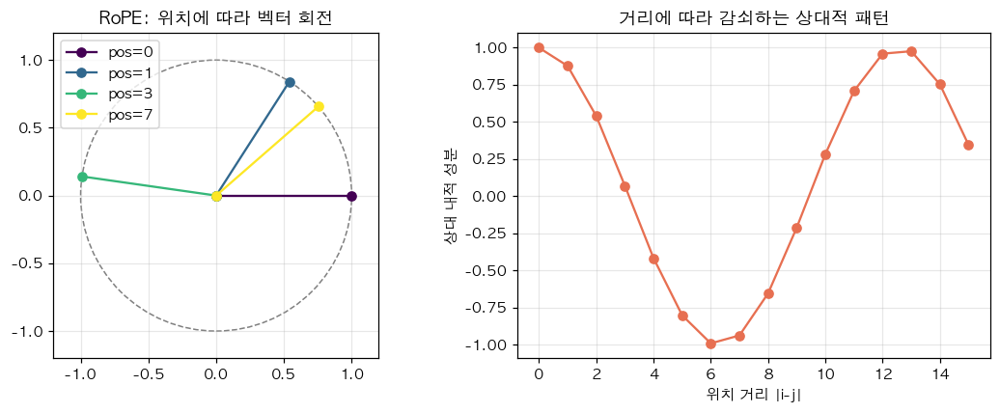

# 24. Rotary Position Embedding (RoPE) — 위치를 "회전"으로 주입

> 📓 [원본 notebook](../solutions/24_rope_solution.ipynb) · 난이도 🔴

## 개념

원본 Transformer 는 position embedding 을 **입력에 더합니다** (additive). 문제: 긴 시퀀스/추론 연장에 약함.

**RoPE**: Q, K 벡터를 **위치에 따른 각도**로 2D 회전. 내적 $q_i \cdot k_j$ 이 **상대 위치 $i - j$** 에만 의존하도록 설계.

$$R_{\theta}(x) = \begin{pmatrix} \cos\theta & -\sin\theta \\ \sin\theta & \cos\theta \end{pmatrix} x$$

여러 주파수로 각 2D 쌍을 회전 → 장/단거리 모두 캡처.



LLaMA, Mistral, GPT-Neo-X 등 대부분 최신 LLM 사용.

## 코드 line-by-line

```python
def apply_rope(q, k):
    B, S, D = q.shape
    pos = torch.arange(S, device=q.device).unsqueeze(1).float()
    dim = torch.arange(0, D, 2, device=q.device).float()
    freqs = 1.0 / (10000.0 ** (dim / D))
    angles = pos * freqs
    cos_a = torch.cos(angles)
    sin_a = torch.sin(angles)

    def rotate(x):
        x1, x2 = x[..., 0::2], x[..., 1::2]
        return torch.stack([x1 * cos_a - x2 * sin_a,
                            x1 * sin_a + x2 * cos_a], dim=-1).flatten(-2)

    return rotate(q), rotate(k)
```

### 주파수 계산

```python
pos = [0, 1, ..., S-1]        # (S, 1)
dim = [0, 2, 4, ..., D-2]      # (D/2,)
freqs = 1 / 10000^(dim/D)      # (D/2,)
```

낮은 차원일수록 **빠른** 회전 (고주파), 높은 차원일수록 **느린** 회전 (저주파). 원리는 sinusoidal position embedding (Attention is All You Need) 과 동일.

### 각도 행렬

```python
angles = pos * freqs   # broadcast → (S, D/2)
cos_a, sin_a           # 각각 (S, D/2)
```

각 position, 각 2D 쌍마다의 회전 각.

### 벡터 쌍으로 회전

```python
x1 = x[..., 0::2]   # 짝수 index (실수부 역할)
x2 = x[..., 1::2]   # 홀수 index (허수부 역할)
```

벡터를 `(D/2, 2)` 꼴의 "복소수 쌍" 으로 본 셈.

```python
rotated = [x1·cos - x2·sin,  x1·sin + x2·cos]
```

이게 2D 회전행렬 곱. 마지막 `.flatten(-2)` 로 원래 차원 복원.

## 왜 내적이 상대 위치에만 의존하는가

$q_i' = R_{i\theta} q$, $k_j' = R_{j\theta} k$ 라 두면:

$$q_i' \cdot k_j' = q^\top R_{i\theta}^\top R_{j\theta} k = q^\top R_{(j-i)\theta} k$$

즉 $i - j$ 에만 의존. **절대 위치** 대신 **상대 위치** 정보가 자연스럽게 공유됩니다.

## 장점

1. **추론 시 context 연장** (NTK / YaRN / PI 등 기법으로 scaling)
2. KV cache 와 호환 — K 만 저장, query 는 그때그때 회전
3. Additive 방식보다 장거리 일반화 우수

## 검증

```python
q = torch.randn(1, 8, 16); k = torch.randn(1, 8, 16)
qr, kr = apply_rope(q, k)
print(qr.shape == q.shape)                                   # True
print(torch.allclose(q.norm(dim=-1), qr.norm(dim=-1), 1e-4)) # True (회전 = norm 보존)
```

## 한 걸음 더

- 구현 트릭: `(x_even, x_odd)` 대신 앞뒤 반반 `(x[:D/2], x[D/2:])` 을 쓰는 variant 도 있음 (LLaMA 구현)
- Context 확장: `base=10000` 을 늘리거나 (NTK scaling), position 인덱스를 나눠 (PI)
- Attention 이 길어질수록 RoPE 덕분에 여전히 동작
