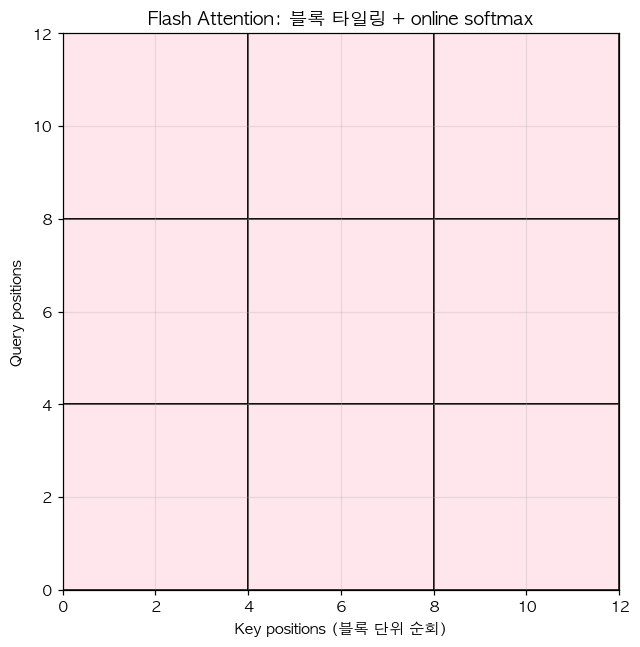

# 25. Flash Attention — 타일링 + online softmax

> 📓 [원본 notebook](../solutions/25_flash_attention_solution.ipynb) · 난이도 🔴

## 개념

일반 attention 의 병목은 **$QK^\top$ 행렬을 HBM 에 쓰고 다시 읽기** — $O(S^2)$ 메모리. Flash Attention 은:

1. Q, K, V 를 **블록** 으로 나눠 처리
2. SRAM (on-chip cache) 에 올려 I/O 줄이기
3. 중간 softmax 를 **증분적으로 (online)** 재정규화

결과: 수학적으로 동일하지만 **메모리 $O(S)$**, 속도 2~4배 향상. 이 예제는 GPU kernel 없이 Python 으로만 알고리즘을 재현.



## 코드 line-by-line

```python
def flash_attention(Q, K, V, block_size=32):
    B, S, D = Q.shape
    output = torch.zeros_like(Q)
    for i in range(0, S, block_size):
        qi = Q[:, i:i+block_size]
        bs_q = qi.shape[1]
        row_max = torch.full((B, bs_q, 1), float('-inf'), device=Q.device)
        row_sum = torch.zeros(B, bs_q, 1, device=Q.device)
        acc = torch.zeros(B, bs_q, D, device=Q.device)
        for j in range(0, S, block_size):
            kj = K[:, j:j+block_size]
            vj = V[:, j:j+block_size]
            scores = torch.bmm(qi, kj.transpose(1, 2)) / math.sqrt(D)
            block_max = scores.max(dim=-1, keepdim=True).values
            new_max = torch.maximum(row_max, block_max)
            correction = torch.exp(row_max - new_max)
            exp_scores = torch.exp(scores - new_max)
            acc = acc * correction + torch.bmm(exp_scores, vj)
            row_sum = row_sum * correction + exp_scores.sum(dim=-1, keepdim=True)
            row_max = new_max
        output[:, i:i+block_size] = acc / row_sum
    return output
```

### 외부 for loop — Query block

각 block `qi = Q[:, i:i+bs]` 마다 독립 처리. 이 block 에 해당하는 **상태 3개** 를 갖고 K/V 전체를 순회합니다:

| 상태 | 역할 | 의미 |
|------|------|------|
| `row_max` | 지금까지 본 scores 의 running max | LSE 안정화용 |
| `row_sum` | $\sum_j \exp(s_j - m)$ 의 running sum | 정규화 분모 |
| `acc` | $\sum_j \exp(s_j - m) v_j$ 의 running sum | 분자 (V 가중합) |

### 내부 for loop — Key block 순회

```python
scores = qi @ kj.T / sqrt(D)                # 이 블록에서의 attention scores
block_max = scores.max(...)                 # 블록 내 최대
new_max = max(row_max, block_max)           # 누적 최대 업데이트
```

### Online softmax 보정

max 가 바뀌면 이전에 계산한 `acc`, `row_sum` 의 **기준점**도 바뀜. 교정 인자:

```python
correction = exp(row_max - new_max)  # 이전 값을 new_max 기준으로 재척도
acc      = acc * correction + exp(scores - new_max) @ vj
row_sum  = row_sum * correction + exp_scores.sum(...)
row_max  = new_max
```

수식으로:

$$\text{acc}_{new} = e^{m_{old}-m_{new}} \cdot \text{acc}_{old} + \sum_{j \in \text{blk}} e^{s_j - m_{new}} v_j$$

이렇게 하면 **한 번에 전체 S 를 보지 않고** 블록 단위로 정확한 softmax·value 합을 계산 가능.

### 최종 출력

```python
output[:, i:i+bs] = acc / row_sum
```

softmax 의 "분자 / 분모" 를 마지막에 한 번만 수행.

## 수학적 정확성

모든 블록을 순회하면 `acc`, `row_sum` 은 **전체** $\sum_j e^{s_j - m} v_j$ 와 $\sum_j e^{s_j - m}$ 과 정확히 같음. 따라서 출력 = standard attention 과 수학적으로 동일.

## 검증

```python
Q, K, V = torch.randn(1, 16, 8), torch.randn(1, 16, 8), torch.randn(1, 16, 8)
out = flash_attention(Q, K, V, block_size=4)
ref = torch.bmm(torch.softmax(torch.bmm(Q, K.transpose(1,2)) / math.sqrt(8), dim=-1), V)
(out - ref).abs().max().item()   # 1e-6 이하
```

## 왜 빠른가 (진짜 구현)

본 Python 버전은 for loop 이라 오히려 느림. 진짜 Flash Attention 은:

- CUDA kernel 로 작성
- SRAM 에 `qi`, `kj`, `vj` 블록 유지 (reload 최소)
- `scores` 를 HBM 에 쓰지 않음 (**O(S²) 메모리 제거의 핵심**)
- fp16 + tensor core 활용

## 한 걸음 더

- Flash Attention 2: 블록 크기/스케줄링 개선
- Flash Attention 3 (H100): 비대칭 구조
- PyTorch 2.0 `F.scaled_dot_product_attention` 이 자동으로 flash 경로 선택
