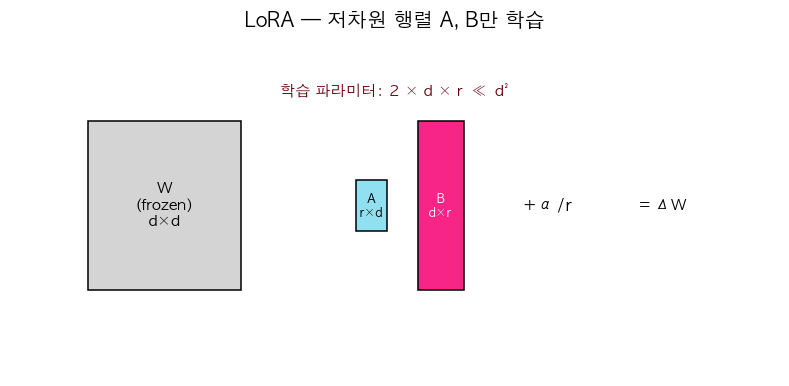

# 26. LoRA — 저차원 행렬만 학습하는 효율적 fine-tuning

> 📓 [원본 notebook](../solutions/26_lora_solution.ipynb) · 난이도 🟡

## 개념

대형 모델의 Linear 층 $W \in \mathbb{R}^{d \times d}$ 전체를 fine-tune 하면 파라미터가 너무 많음. **LoRA (Low-Rank Adaptation)**: 원래 $W$ 는 **동결** 하고, 작은 rank $r$ 행렬 곱으로 된 **델타** 만 학습:

$$y = W x + \frac{\alpha}{r} (B A) x$$

- $A \in \mathbb{R}^{r \times d}$, $B \in \mathbb{R}^{d \times r}$
- 학습 파라미터: $2 d r$ (vs $d^2$) — rank=8 에 d=4096 이면 **256배 절감**
- $\alpha/r$ 은 scaling factor — 초기 영향 크기 조절



## 코드 line-by-line

```python
class LoRALinear(nn.Module):
    def __init__(self, in_features, out_features, rank, alpha=1.0):
        super().__init__()
        self.linear = nn.Linear(in_features, out_features)
        self.linear.weight.requires_grad_(False)
        self.linear.bias.requires_grad_(False)
        self.lora_A = nn.Parameter(torch.randn(rank, in_features) * 0.01)
        self.lora_B = nn.Parameter(torch.zeros(out_features, rank))
        self.scaling = alpha / rank

    def forward(self, x):
        return self.linear(x) + (x @ self.lora_A.T @ self.lora_B.T) * self.scaling
```

### `__init__`

| 라인 | 코드 | 설명 |
|------|------|------|
| 4 | `self.linear = nn.Linear(...)` | 원래 pretrained Linear 를 그대로 감쌈 |
| 5-6 | `.requires_grad_(False)` | **동결**. backward 에서 grad 계산 안 함. |
| 7 | `lora_A` 는 작은 정규분포(`*0.01`) | 초기값을 작게 |
| 8 | `lora_B` 는 **0 으로** 초기화 | 학습 시작 시 ΔW = B·A = 0 → 원 모델과 완전 동일 |
| 9 | `scaling = alpha / rank` | rank 에 따라 ΔW 규모 보정 |

**핵심**: `B = 0` 으로 시작하므로 초기에는 LoRA 가 출력에 영향 없음 → 안정적 fine-tune.

### `forward`

```python
x @ self.lora_A.T       # (B, d) @ (d, r) = (B, r)
          @ self.lora_B.T  # (B, r) @ (r, d) = (B, d)
          * self.scaling
```

`W`-shape 행렬을 메모리에 만들지 않고 **두 번의 matmul** 로 ΔW 적용. 메모리와 계산 모두 저렴.

## 왜 효과적인가

경험적 관찰: **pretrained 모델의 fine-tuning 업데이트는 low-rank 근사로 잘 맞는다**. 즉 ΔW 의 효과적 rank 가 원 rank 보다 훨씬 작음. LoRA 는 이를 정확히 반영.

## 파라미터 수 비교

d_in=16, d_out=8, rank=4 기준:

| 모드 | 학습 파라미터 |
|------|-------------|
| Full fine-tune | 16×8 + 8 = 136 |
| LoRA | 4×16 + 8×4 = 96 (+ 8 bias 는 frozen) |

현실 LLM 규모 (d=4096) 로 가면 차이가 기하급수적.

## 배포

LoRA 학습 후 $W' = W + \frac{\alpha}{r} BA$ 로 **merge** 하면 inference 에 추가 비용 없음:

```python
merged = linear.weight + (lora_B @ lora_A) * scaling
```

## 한 걸음 더

- **QLoRA**: 4-bit 양자화 + LoRA. 매우 큰 모델도 단일 GPU fine-tune 가능
- **Adapter**: LoRA 이전 방식. bottleneck MLP 삽입
- **DoRA, (IA)³**: 최근 개선 기법들
- 대부분 LoRA 는 **attention 의 Q, V projection** 에만 붙임 (FFN 에는 안 붙여도 성능 충분)
