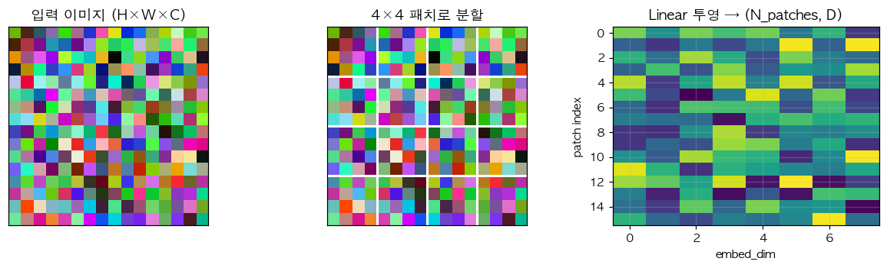

# 27. ViT Patch Embedding — 이미지를 토큰 시퀀스로

> 📓 [원본 notebook](../solutions/27_vit_patch_solution.ipynb) · 난이도 🟡

## 개념

**Vision Transformer (ViT)** 는 CNN 대신 Transformer 로 이미지를 처리합니다. 핵심은 **이미지를 고정 크기 패치로 잘라 시퀀스로 만들기**:

- 입력: `(B, 3, 224, 224)`
- 16×16 패치로 분할 → 14×14 = **196 패치**
- 각 패치 (16×16×3 = 768 픽셀) 를 Linear 로 embed_dim 벡터로 투영
- 결과: `(B, 196, embed_dim)` — Transformer 가 받을 수 있는 시퀀스



## 코드 line-by-line

```python
class PatchEmbedding(nn.Module):
    def __init__(self, img_size, patch_size, in_channels, embed_dim):
        super().__init__()
        self.patch_size = patch_size
        self.num_patches = (img_size // patch_size) ** 2
        self.proj = nn.Linear(in_channels * patch_size * patch_size, embed_dim)

    def forward(self, x):
        B, C, H, W = x.shape
        p = self.patch_size
        n_h, n_w = H // p, W // p
        x = x.reshape(B, C, n_h, p, n_w, p)
        x = x.permute(0, 2, 4, 1, 3, 5).reshape(B, n_h * n_w, C * p * p)
        return self.proj(x)
```

### `__init__`

| 라인 | 설명 |
|------|------|
| `num_patches = (img_size // patch_size)²` | 224/16=14 → 196 |
| `proj = Linear(C·p·p, D)` | patch 픽셀 플래튼 → embed_dim |

### `forward` — shape 변환 체인

```python
x : (B, C, H, W)

.reshape(B, C, n_h, p, n_w, p)
  # H 축을 (n_h, p) 로, W 축을 (n_w, p) 로 나눔
  # (B, C, 14, 16, 14, 16)
```

각 축 의미:
- `n_h`: 세로 patch 인덱스 (0..13)
- `p`: patch 내부 세로 위치 (0..15)

```python
.permute(0, 2, 4, 1, 3, 5)
  # (B, n_h, n_w, C, p, p)
```

patch 인덱스 축을 **앞으로**, patch 내부 + channel 을 **뒤로**. 핵심 reorder.

```python
.reshape(B, n_h * n_w, C * p * p)
  # (B, 196, 768)
```

patch 축 2개를 합쳐 시퀀스로, patch 내부를 flatten 해 feature 로.

```python
self.proj(x)
  # (B, 196, embed_dim)
```

마지막 Linear.

## Conv2d 동치 구현

놀랍게도 이 연산은 **stride=patch_size, kernel=patch_size 인 Conv2d** 와 수학적으로 같습니다:

```python
conv = nn.Conv2d(C, embed_dim, kernel_size=p, stride=p)
x = conv(x)                  # (B, embed_dim, n_h, n_w)
x = x.flatten(2).transpose(1, 2)  # (B, n_h*n_w, embed_dim)
```

실제 타 ViT 구현들이 이 방식을 사용 — 한 줄로 끝나고 cuDNN 최적화를 탑니다. → [Conv2d (22번)](22_conv2d.md) 참고.

## 검증

```python
pe = PatchEmbedding(224, 16, 3, 768)
pe(torch.randn(1, 3, 224, 224)).shape   # (1, 196, 768)
pe.num_patches                            # 196
```

## ViT 전체 파이프라인

```
Image (B, 3, 224, 224)
  ↓ PatchEmbedding
Patch tokens (B, 196, D)
  ↓ [CLS] token prepend, + position embedding
(B, 197, D)
  ↓ Transformer encoder × N
(B, 197, D)
  ↓ take [CLS], Linear classifier
(B, num_classes)
```

## 한 걸음 더

- **CLS token**: 학습 가능한 하나의 벡터를 앞에 붙여 분류용 representation 으로 씀
- **Position embedding**: 1D 학습가능 또는 2D sinusoidal
- **DINO, MAE**: 자기지도학습으로 ViT 의 pretraining 성능 대폭 향상
- Hybrid (CNN + Transformer) 나 Swin (local window attention) 등 변형 다수
