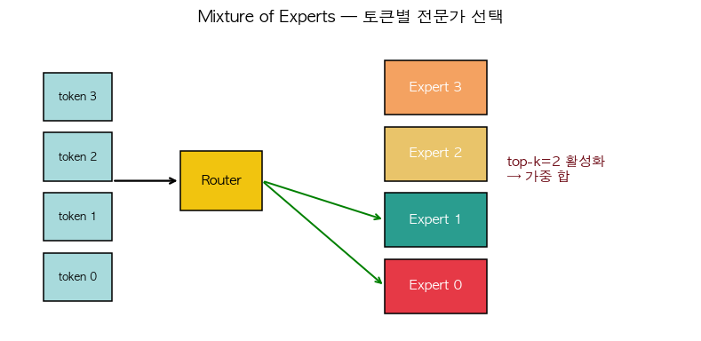

# 28. Mixture of Experts (MoE) — 조건부 연산

> 📓 [원본 notebook](../solutions/28_moe_solution.ipynb) · 난이도 🔴

## 개념

FFN 을 하나만 쓰는 대신 **여러 개의 expert** 를 두고, 각 토큰마다 **top-k 전문가만** 활성화합니다. Router 가 어느 expert 로 보낼지 결정.

- 전체 파라미터 ↑ (capacity ↑)
- 토큰당 실제 연산 ≈ top-k × 단일 expert (sparse)

Mixtral-8x7B, Switch Transformer, GLaM 등이 사용.

$$y = \sum_{e \in \text{top-k}(x)} \text{softmax}(\text{router}(x))_e \cdot \text{Expert}_e(x)$$



## 코드 line-by-line

```python
class MixtureOfExperts(nn.Module):
    def __init__(self, d_model, d_ff, num_experts, top_k=2):
        super().__init__()
        self.top_k = top_k
        self.router = nn.Linear(d_model, num_experts)
        self.experts = nn.ModuleList([
            nn.Sequential(nn.Linear(d_model, d_ff), nn.ReLU(), nn.Linear(d_ff, d_model))
            for _ in range(num_experts)
        ])
```

| 라인 | 설명 |
|------|------|
| `router` | 각 token → 각 expert 점수. |
| `experts` | num_experts 개의 독립 FFN. `nn.ModuleList` 는 `nn.Module` 들을 모아 `parameters()` 에 자동 등록. |

### `forward`

```python
    def forward(self, x):
        orig_shape = x.shape
        if x.dim() == 3:
            B, S, D = x.shape
            x_flat = x.reshape(-1, D)
        else:
            x_flat = x
```

3D (B, S, D) 입력을 2D (B·S, D) 로 평탄화 — 토큰 단위로 라우팅.

```python
        logits = self.router(x_flat)              # (N, E)
        top_vals, top_idx = logits.topk(self.top_k, dim=-1)  # (N, k), (N, k)
        weights = torch.softmax(top_vals, dim=-1)  # (N, k)
```

- `logits` : 각 토큰 × expert 의 점수
- `topk` : 각 토큰에서 상위 k 개 expert 인덱스
- `softmax` : top-k **안에서만** 정규화 — 선택된 전문가들의 상대적 가중치

```python
        output = torch.zeros_like(x_flat)
        for k in range(self.top_k):
            for e in range(len(self.experts)):
                mask = (top_idx[:, k] == e)
                if mask.any():
                    output[mask] += weights[mask, k:k+1] * self.experts[e](x_flat[mask])
        return output.reshape(orig_shape)
```

### 디스패치 로직

```python
for k in [0, 1, ...]:      # 각 top-k 슬롯
    for e in [0, 1, ...]:   # 각 expert
        # 이 슬롯에서 expert e 로 갈 토큰들 모으기
        mask = (top_idx[:, k] == e)
        if mask.any():
            # 토큰 서브셋에만 expert 실행
            output[mask] += weight * expert_e(x[mask])
```

**핵심 아이디어**: expert 를 **선택된 토큰에만** 호출. 전체 토큰에 대해 안 돌림 — 이것이 sparsity 의 진짜 이득.

## 왜 2중 for-loop?

각 `(k, e)` 쌍마다 토큰을 **모아서 한 번만 expert 호출**. 토큰별 호출하면 GPU 에서 매우 비효율.

실제 고성능 구현 (예: DeepSpeed MoE, Mixtral) 은 `scatter/gather` 와 `all-to-all` 로 멀티 GPU 에서 효율적 분산.

## Load balancing 문제

Router 가 항상 같은 expert 만 뽑으면 다른 expert 는 학습되지 않음. 실제 논문에서는 **auxiliary loss** (각 expert 의 평균 사용량을 균등하게) 를 추가.

본 예제는 auxiliary loss 생략.

## 검증

```python
moe = MixtureOfExperts(32, 64, num_experts=4, top_k=2)
moe(torch.randn(2, 8, 32)).shape   # (2, 8, 32)
```

파라미터 수: 일반 FFN 대비 `num_experts` 배 증가 (capacity), 연산은 `top_k/num_experts` 만 사용.

## 한 걸음 더

- Mixtral 8x7B: 실제 활성 파라미터는 12B 수준이지만 총 47B capacity
- **Expert parallelism**: expert 를 여러 GPU 에 분산해 메모리 돌파
- **DeepSeek MoE**: shared expert + routed expert 하이브리드
