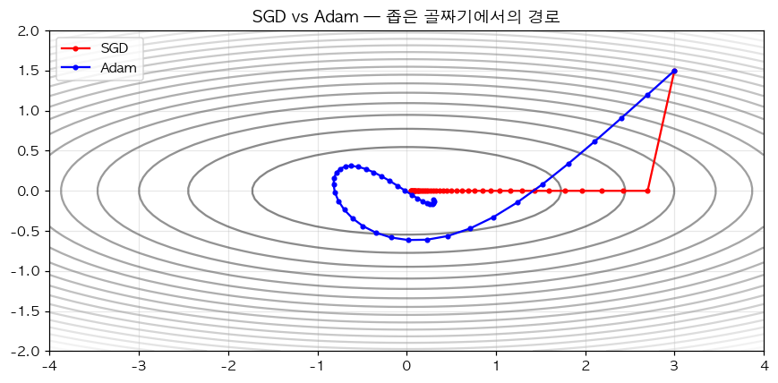

# 29. Adam Optimizer — 가장 널리 쓰이는 옵티마이저

> 📓 [원본 notebook](../solutions/29_adam_solution.ipynb) · 난이도 🟡

## 개념

**Adam** = Momentum + RMSProp + bias 보정. 각 파라미터마다 **1차 모멘트(평균)** 와 **2차 모멘트(분산)** 를 관리:

$$\begin{aligned}
m_t &= \beta_1 m_{t-1} + (1-\beta_1) g_t \\
v_t &= \beta_2 v_{t-1} + (1-\beta_2) g_t^2 \\
\hat{m}_t &= m_t / (1 - \beta_1^t), \quad \hat{v}_t = v_t / (1 - \beta_2^t) \\
\theta_t &= \theta_{t-1} - \eta \frac{\hat{m}_t}{\sqrt{\hat{v}_t} + \epsilon}
\end{aligned}$$

- **모멘텀** (m): 관성 — 비슷한 방향 지속
- **RMSProp** (v): 각 파라미터별 적응형 학습률
- **Bias correction**: 초기 $m_0, v_0 = 0$ 이라 초기에 underestimate 되는 걸 교정



## 코드 line-by-line

```python
class MyAdam:
    def __init__(self, params, lr=1e-3, betas=(0.9, 0.999), eps=1e-8):
        self.params = list(params)
        self.lr = lr
        self.beta1, self.beta2 = betas
        self.eps = eps
        self.t = 0
        self.m = [torch.zeros_like(p) for p in self.params]
        self.v = [torch.zeros_like(p) for p in self.params]
```

| 라인 | 설명 |
|------|------|
| `lr=1e-3` | 흔한 기본값. Transformer 는 보통 `1e-4 ~ 5e-4` |
| `betas=(0.9, 0.999)` | 논문 권장값. 1차/2차 모멘트 감쇠율 |
| `eps=1e-8` | 0-division 방지 |
| `m, v` | 각 파라미터별 상태. 같은 shape 의 0 텐서로 초기화 |

### `step` — 한 번의 업데이트

```python
    def step(self):
        self.t += 1
        with torch.no_grad():
            for i, p in enumerate(self.params):
                if p.grad is None:
                    continue
                self.m[i] = self.beta1 * self.m[i] + (1 - self.beta1) * p.grad
                self.v[i] = self.beta2 * self.v[i] + (1 - self.beta2) * p.grad ** 2
                m_hat = self.m[i] / (1 - self.beta1 ** self.t)
                v_hat = self.v[i] / (1 - self.beta2 ** self.t)
                p -= self.lr * m_hat / (torch.sqrt(v_hat) + self.eps)
```

| 라인 | 코드 | 설명 |
|------|------|------|
| `self.t += 1` | step 카운트 |
| `torch.no_grad()` | 파라미터 업데이트는 autograd 밖에서 |
| `self.m[i] = β1 m + (1-β1) g` | 1차 모멘트 EMA |
| `self.v[i] = β2 v + (1-β2) g²` | 2차 모멘트 EMA (원소별 제곱) |
| `m_hat, v_hat` | bias 보정. `t=1` 에서 $m_1 = 0.1 g_1$ 이지만 $\hat{m}_1 = g_1$ 이 되어 실제 gradient 와 같아짐 |
| `p -= lr · m_hat / (√v_hat + eps)` | 업데이트. 큰 gradient 가 자주 나오는 파라미터는 `√v` 가 커져 step 이 작아짐 (adaptive) |

### `zero_grad`

```python
    def zero_grad(self):
        for p in self.params:
            if p.grad is not None:
                p.grad.zero_()
```

매 step 전 gradient 를 0 으로 (이전 backward 에 쌓여있는 값 초기화).

## 왜 bias correction 이 필요한가

$m_t = (1-\beta_1) \sum_{k=1}^{t} \beta_1^{t-k} g_k$. 모든 $g_k = g$ 라 가정하면:

$$m_t = (1-\beta_1^t) g \neq g$$

$\hat{m}_t = m_t / (1-\beta_1^t) = g$. 초기 step 에서 특히 중요 (예: $t=1$, $\beta_1=0.9$ 이면 $m_1 = 0.1 g$ → 보정 안 하면 거의 안 움직임).

## SGD 와의 비교

동일한 언덕 아래로 굴러가는 문제에서:
- SGD: 좁은 골짜기에서 지그재그
- Adam: v 가 지그재그 축을 누그러뜨려 **부드러운 경로**

(위 그림 참고)

## 한 걸음 더

- **AdamW** (decoupled weight decay): weight decay 를 gradient 에 안 섞고 따로 처리 — 현재 사실상 표준
- **Lion**: 2023, Google. sign(m) 만 사용해 메모리 절반. 빠르게 확산 중
- Adam 은 **메모리 2× 파라미터** 추가 소모 (m, v). 큰 모델에서 부담 → [Gradient Accumulation (31번)](31_gradient_accumulation.md) 등으로 극복
