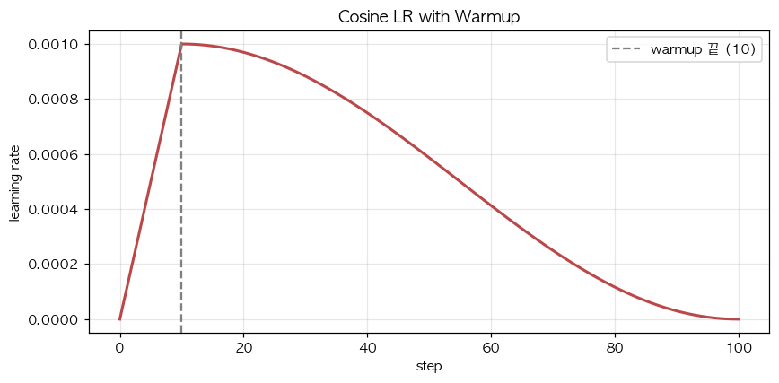

# 30. Cosine LR Scheduler with Warmup — LLM 학습의 표준 스케줄

> 📓 [원본 notebook](../solutions/30_cosine_lr_solution.ipynb) · 난이도 🟢

## 개념

학습률을 고정보다 시간에 따라 바꾸면 더 잘 수렴합니다. 전형적 스케줄:

1. **Warmup**: `0 → max_lr` 로 선형 증가 (N_warm step)
2. **Cosine decay**: `max_lr → min_lr` 로 부드럽게 감소

$$\eta_t = \begin{cases}
\eta_\max \cdot \frac{t}{N_\text{warm}} & t < N_\text{warm} \\
\eta_\min + \frac{1}{2}(\eta_\max - \eta_\min) (1 + \cos(\pi \cdot p)) & t \ge N_\text{warm}
\end{cases}$$

$p = \frac{t - N_\text{warm}}{N_\text{total} - N_\text{warm}}$



## 왜 warmup?

초기에는 gradient 통계(특히 Adam 의 v) 가 불안정. 큰 lr 로 시작하면 발산. 천천히 올려 안정화.

## 왜 cosine?

- 끝으로 갈수록 lr 이 작아져 **수렴 안정**
- Step decay(계단형) 보다 부드러워 loss 곡선이 매끈
- Cosine 은 시작/끝에서 완만, 중간에서 빠르게 감소

## 코드 line-by-line

```python
def cosine_lr_schedule(step, total_steps, warmup_steps, max_lr, min_lr=0.0):
    if step < warmup_steps:
        return max_lr * step / warmup_steps
    if step >= total_steps:
        return min_lr
    progress = (step - warmup_steps) / (total_steps - warmup_steps)
    return min_lr + 0.5 * (max_lr - min_lr) * (1.0 + math.cos(math.pi * progress))
```

| 라인 | 코드 | 설명 |
|------|------|------|
| 2-3 | warmup 구간 | 선형 증가. `step=0 → 0`, `step=N_warm → max_lr`. |
| 4-5 | 종료 구간 | 남은 step 없음 — `min_lr` 반환 (재시작/후속 단계 대비). |
| 6 | `progress` | warmup 이후의 상대적 진행도 `[0, 1]` |
| 7 | `cos(π · p)` | p=0 에서 1, p=1 에서 -1 |
|   | `0.5 · (max - min) · (1 + cos)` | p=0 → `max-min`, p=1 → 0 |
|   | `+ min_lr` | 바닥값 추가 |

## 사용 패턴

```python
for step in range(total_steps):
    lr = cosine_lr_schedule(step, total_steps, warmup_steps=2000, max_lr=1e-4)
    for g in optimizer.param_groups:
        g["lr"] = lr
    train_one_step(...)
```

매 step **모든 param group 의 lr** 을 새 값으로.

## 전형적 값 (LLM)

- `max_lr`: `1e-4 ~ 6e-4`
- `min_lr`: `max_lr × 0.1` 또는 0
- `warmup_steps`: 1% ~ 5% 전체 step (예: 2000 / 100000)
- Transformer 학습 레시피에서 거의 모든 공개 모델이 이 패턴

## 검증

```python
lrs = [cosine_lr_schedule(i, 100, 10, 0.001) for i in range(101)]
# step 0:   0.0
# step 10:  0.001 (warmup 끝)
# step 55:  0.0005 (중간)
# step 100: 0.0    (완전 감쇠)
```

## 한 걸음 더

- **Cosine with restart**: 여러 cycle 로 나눠 다시 올림 (SGDR)
- **Linear decay**: cosine 대신 직선. 구현 단순
- **Inverse square root decay**: Vaswani 2017 원본 Transformer 방식
- PyTorch 에는 `torch.optim.lr_scheduler.CosineAnnealingLR` 이 내장
