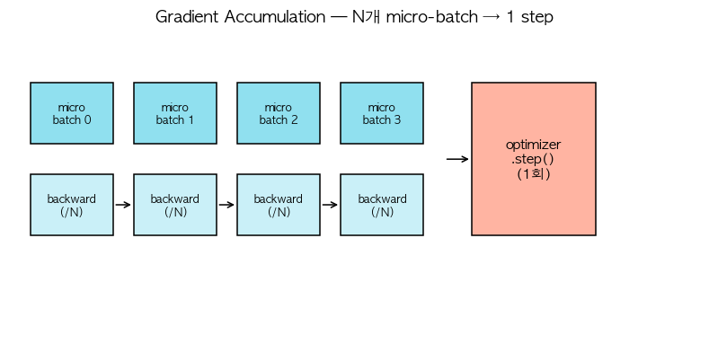

# 31. Gradient Accumulation — GPU 메모리 제한 돌파

> 📓 [원본 notebook](../solutions/31_gradient_accumulation_solution.ipynb) · 난이도 🟢

## 개념

큰 배치 크기로 학습하고 싶은데 GPU 메모리가 부족할 때: **N 개의 micro-batch 를 forward/backward** 하면서 gradient 를 **쌓아두었다가** 한 번에 step.

- 유효 배치 = `N × micro_batch`
- 한 번의 step 이 진짜 큰 배치로 학습한 것과 동일
- 각 micro-batch 의 loss 는 `/N` 으로 나눠 평균을 맞춤



## 코드 line-by-line

```python
def accumulated_step(model, optimizer, loss_fn, micro_batches):
    optimizer.zero_grad()
    total_loss = 0.0
    n = len(micro_batches)
    for x, y in micro_batches:
        loss = loss_fn(model(x), y) / n
        loss.backward()
        total_loss += loss.item()
    optimizer.step()
    return total_loss
```

| 라인 | 코드 | 설명 |
|------|------|------|
| 2 | `optimizer.zero_grad()` | **루프 시작 전 한 번만**. 매 backward 마다 zero 하면 누적 안 됨. |
| 5 | `loss_fn(model(x), y) / n` | **평균 맞추기**. 그냥 sum 하면 큰 배치 기울기가 N 배 됨. |
| 6 | `loss.backward()` | gradient 계산 → `p.grad` 에 **누적** (기본 동작). |
| 7 | `total_loss += loss.item()` | 로깅용. `.item()` 으로 계산 그래프와 분리. |
| 8 | `optimizer.step()` | **루프 종료 후 한 번만**. 축적된 gradient 로 업데이트. |

## `/n` 이 왜 필요한가

이론적으로 `loss = (1/B) Σ loss_i` 가 "배치 평균 loss". micro_batch 안에서 이미 `mean` 으로 평균이 계산되므로, N 개 micro_batch 를 sum 하면 N 배 과도. `/n` 으로 보정.

## 메모리 vs 시간 trade-off

- 메모리: `micro_batch` 크기에만 비례 (activation) — 작게 유지
- 시간: 유효 배치 처리에 N 배 걸림 (하지만 어차피 같은 데이터)

보통 "너무 큰 배치를 쓰고 싶은데 OOM" 인 상황에서 유용.

## 주의: `zero_grad` 위치

```python
# WRONG
for x, y in micro_batches:
    optimizer.zero_grad()   # ✗ 매번 초기화 → 누적 안 됨
    loss.backward()

# RIGHT
optimizer.zero_grad()
for x, y in micro_batches:
    loss.backward()         # gradient 누적
optimizer.step()
```

## BatchNorm 주의

BN 은 **micro_batch 단위로** 통계를 계산. 원래 큰 배치로 학습한 것과 통계가 미묘하게 다름.

- LayerNorm/RMSNorm 사용 모델은 영향 없음 (배치 독립)
- BN 많이 쓰는 CNN 은 accumulation 과 궁합 나쁨 → SyncBN 등 대안 필요

## DDP 와의 상호작용

Distributed Data Parallel 에서는 매 backward 마다 **all-reduce** 가 일어나 비효율.

```python
with model.no_sync():   # all-reduce 스킵
    for i, (x, y) in enumerate(micro_batches[:-1]):
        (loss / n).backward()
# 마지막 step 은 동기화
(loss / n).backward()
optimizer.step()
```

## 사용 예

```python
model = nn.Linear(4, 2)
opt = torch.optim.SGD(model.parameters(), lr=0.01)
micro_batches = [(torch.randn(2, 4), torch.randn(2, 2)) for _ in range(4)]
loss = accumulated_step(model, opt, nn.MSELoss(), micro_batches)
# 유효 배치 크기 = 2 × 4 = 8
```

## 한 걸음 더

- **Gradient checkpointing**: activation 을 저장 대신 재계산 — 더 큰 메모리 절약
- **ZeRO (DeepSpeed)**: optimizer state 도 분산
- **FSDP**: PyTorch 의 ZeRO 상응물
