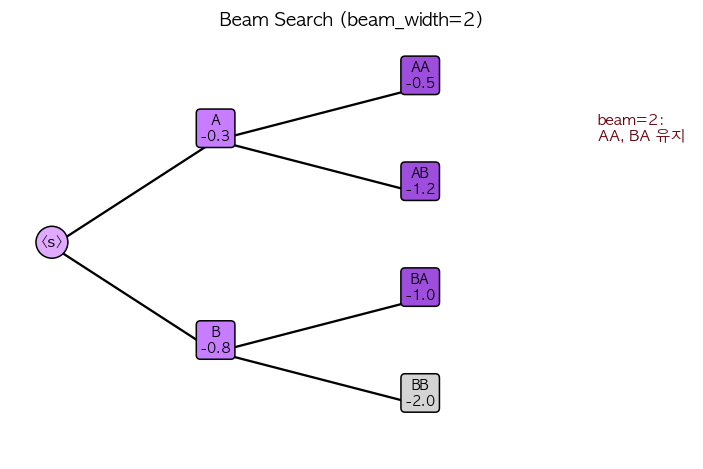

# 33. Beam Search — 탐색 기반 디코딩

> 📓 [원본 notebook](../solutions/33_beam_search_solution.ipynb) · 난이도 🟡

## 개념

샘플링이 "랜덤" 이라면, **Beam search** 는 "탐색" 입니다. 각 step 에서 **상위 B 개 후보** (beam) 를 유지하며 확장 → 전체 시퀀스의 **log-probability 합**이 최대인 경로 찾기.

$$\text{score}(\text{seq}) = \sum_t \log p(y_t | y_{<t})$$

- Beam width 1 = greedy
- Beam width 클수록 탐색 넓어지고 느려짐
- 번역, 요약 등 정답이 뚜렷한 task 에서 강함



## 코드 line-by-line

```python
def beam_search(log_prob_fn, start_token, max_len, beam_width, eos_token):
    beams = [(0.0, [start_token])]
    completed = []
```

| 변수 | 의미 |
|------|------|
| `beams` | 아직 끝나지 않은 후보 목록. `(score, sequence)` |
| `completed` | EOS 도달 후보 |

### 메인 루프

```python
    for _ in range(max_len):
        candidates = []
        for score, seq in beams:
            if seq[-1] == eos_token:
                completed.append((score, seq))
                continue
            log_probs = log_prob_fn(torch.tensor(seq))
            topk_lp, topk_idx = log_probs.topk(beam_width)
            for j in range(beam_width):
                candidates.append(
                    (score + topk_lp[j].item(), seq + [topk_idx[j].item()])
                )
        if not candidates:
            break
        candidates.sort(key=lambda x: x[0], reverse=True)
        beams = candidates[:beam_width]
```

| 라인 | 설명 |
|------|------|
| `candidates = []` | 이번 step 의 모든 확장 후보 |
| `if seq[-1] == eos` | 이미 끝났으면 완료 목록으로 이동 |
| `log_prob_fn(tensor(seq))` | 주어진 sequence 에 대한 다음 토큰 log-probs `(V,)` |
| `log_probs.topk(B)` | 상위 B 개 토큰 선택 |
| `score + topk_lp[j]` | 기존 점수 + 새 토큰의 log-prob. **log 더하기** = 확률 곱하기 |
| `candidates.sort(...)` | **전체 후보** 중 상위 B 개 유지 (정렬 후 자름) |

즉 매 step 마다: `B × B = B²` 후보 생성 → 상위 `B` 만 유지.

### 종료 처리

```python
    all_seqs = completed + beams
    all_seqs.sort(key=lambda x: x[0], reverse=True)
    return all_seqs[0][1]
```

max_len 도달 후 완료된 것 + 남은 beam 중 **최고 점수** 반환.

## Length normalization

순수 score 합은 **짧은 문장**에 유리 (토큰 수 ≈ 적으면 합도 작을 가능성 높지만 경쟁에서 이기기도 함). 실전에서는 길이로 나누거나 $\text{score}/L^\alpha$ 로 보정. 본 예제는 단순화를 위해 생략.

## 실사용 시 주의

- Beam search 는 **다양성이 부족**: 모든 beam 이 비슷한 문장
- 해결: Diverse beam search, group beam search
- LLM 대화/창작에서는 top-p 샘플링이 더 선호됨
- 번역/요약에서는 여전히 beam search 가 강함

## 검증

```python
def simple_fn(tokens):
    lp = torch.full((5,), -10.0)
    lp[min(len(tokens), 4)] = 0.0   # 항상 "증가하는 인덱스" 를 최고로
    return lp

seq = beam_search(simple_fn, start_token=0, max_len=5, beam_width=2, eos_token=4)
# [0, 1, 2, 3, 4]
```

각 step 최고 토큰이 명확히 정해져 있어 beam 이 바로 찾아냄.

## 한 걸음 더

- **Length penalty**: `score / L^α`, α ≈ 0.6~1.0 (Google NMT)
- **Coverage**: 입력 토큰을 한 번씩 다 봐야 끝나도록 패널티
- **Constrained beam search**: 특정 키워드 포함 강제
- LLM 의 `model.generate(num_beams=4)` 이 이 알고리즘
