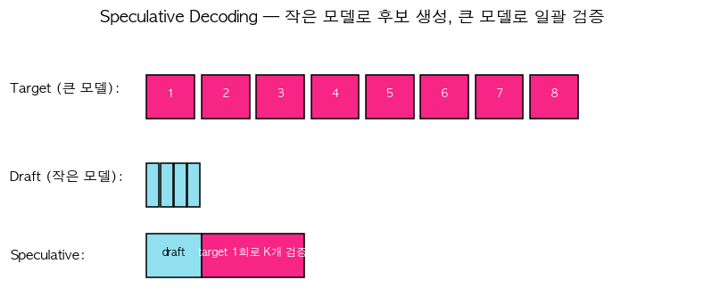

# 34. Speculative Decoding — 작은 모델로 후보 생성, 큰 모델로 일괄 검증

> 📓 [원본 notebook](../solutions/34_speculative_decoding_solution.ipynb) · 난이도 🔴

## 개념

LLM 추론 속도의 병목은 "매 step 큰 모델 forward". Speculative decoding:

1. **Draft model** (작은·빠른 모델) 이 K 개 토큰을 빠르게 생성
2. **Target model** (진짜 큰 모델) 이 K 개를 **한 번의 forward 로** 병렬 검증
3. 각 토큰을 **accept/reject** (rejection sampling) — 분포는 target 과 완벽히 동일

결과: 평균적으로 1 forward 당 여러 토큰 확정 → **2~3배 속도**, 품질 손실 없음.



## 핵심 수식

target 확률 $p(x)$, draft 확률 $q(x)$ 가 주어졌을 때 토큰 $x$ 를 받아들일 확률:

$$\alpha(x) = \min\!\left(1, \frac{p(x)}{q(x)}\right)$$

거부되면 **보정 분포** $\tilde{p}(x) \propto \max(p(x) - q(x), 0)$ 에서 재샘플링. 이 과정이 **target 과 수학적으로 동일한 분포**를 보장.

## 코드 line-by-line

```python
def speculative_decode(target_probs, draft_probs, draft_tokens):
    K = len(draft_tokens)
    accepted = []
    for i in range(K):
        t = draft_tokens[i].item()
        ratio = target_probs[i, t] / max(draft_probs[i, t].item(), 1e-10)
        if torch.rand(1).item() < min(1.0, ratio.item()):
            accepted.append(t)
        else:
            adjusted = torch.clamp(target_probs[i] - draft_probs[i], min=0)
            s = adjusted.sum()
            if s > 0:
                adjusted = adjusted / s
            else:
                adjusted = torch.ones_like(adjusted) / adjusted.shape[0]
            accepted.append(torch.multinomial(adjusted, 1).item())
            return accepted
    return accepted
```

| 라인 | 설명 |
|------|------|
| `target_probs`, `draft_probs` | shape `(K, V)` — 각 위치의 완전한 확률분포 |
| `draft_tokens` | draft 모델이 제안한 K 개 토큰 |

### K 개를 순차 검증

```python
t = draft_tokens[i].item()
ratio = target_probs[i, t] / max(draft_probs[i, t], 1e-10)
```

draft 가 제안한 토큰 t 에 대한 accept 확률 계산.

### Accept 경로

```python
if torch.rand() < min(1.0, ratio):
    accepted.append(t)
```

- `ratio ≥ 1` 이면 항상 accept
- `ratio < 1` 이면 확률적으로 accept (target 이 덜 선호하는 비율만큼)

### Reject → 재샘플링 + 조기 종료

```python
else:
    adjusted = clamp(target_probs[i] - draft_probs[i], min=0)
    adjusted /= adjusted.sum()
    accepted.append(multinomial(adjusted, 1))
    return accepted   # 중요: 여기서 바로 return
```

거부된 위치에서는 target - draft 의 양수 부분을 새 분포로 만들어 샘플링. 그리고 **이 위치까지만** 반환 (그 뒤 draft 후보들은 이미 invalid).

### 엣지 케이스

```python
if s > 0:
    adjusted = adjusted / s
else:
    adjusted = torch.ones_like(adjusted) / adjusted.shape[0]
```

adjusted 가 전부 0 인 경우 (이론상 희귀) 균등분포로 fallback.

## 왜 수학적으로 동일한 분포가 보장되는가

- Accept: $q(x) \cdot \min(1, p(x)/q(x)) = \min(p(x), q(x))$
- Reject 후 재샘플: $\max(p(x) - q(x), 0)$ 확률로 x
- 둘 합: $\min(p, q) + \max(p - q, 0) = p$

정확히 target 분포 p 와 일치. → **품질 손실 제로**.

## 속도 이득의 조건

- Draft 와 target 분포가 비슷해야 (같은 family, 작은 버전)
- Target forward 가 draft 보다 훨씬 비싸야
- `K` (draft 길이) 가 적당해야 — 너무 길면 reject 확률 커짐

## 검증

```python
probs = torch.softmax(torch.randn(4, 10), dim=-1)
tokens = torch.tensor([2, 5, 1, 8])
# draft == target 이면 모두 accept (ratio=1)
speculative_decode(probs, probs, tokens)   # 원래 tokens + 재샘플 0
```

## 한 걸음 더

- **Medusa**: 여러 head 가 각 위치 예측 → draft 모델 불필요
- **EAGLE**: auto-regressive feature-level drafting
- **vLLM, TensorRT-LLM** 등 production 엔진에서 기본 탑재
