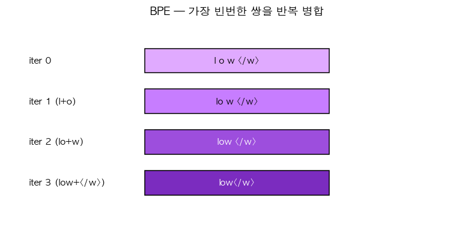

# 35. Byte-Pair Encoding (BPE) — 토크나이저의 원리

> 📓 [원본 notebook](../solutions/35_bpe_solution.ipynb) · 난이도 🟡

## 개념

단어 단위 토큰화는 OOV(out-of-vocab) 문제. 문자 단위는 시퀀스가 너무 길어짐. 타협: **자주 함께 나타나는 두 문자**를 하나의 토큰으로 합쳐 나가는 방식.

Algorithm:
1. 시작: 모든 단어를 문자 시퀀스 + 단어 끝 마커 `</w>` 로
2. **가장 빈도가 높은 (char1, char2) 쌍** 찾기
3. 그 쌍을 하나의 새 토큰으로 합침
4. 원하는 merge 횟수까지 반복



GPT-2, Llama 등의 토크나이저 원리 (실제는 byte-level BPE 변형).

## 코드 line-by-line

```python
class SimpleBPE:
    def __init__(self):
        self.merges = []
```

학습된 merge 규칙을 순서대로 저장.

### train

```python
    def train(self, corpus, num_merges):
        vocab = {}
        for word in corpus:
            symbols = tuple(word) + ('</w>',)
            vocab[symbols] = vocab.get(symbols, 0) + 1
```

- 각 단어를 **문자 tuple + `</w>`** 로 표현
- `vocab`: `(symbols) → count`. 단어 빈도 dict.

```python
        for _ in range(num_merges):
            pairs = {}
            for word, freq in vocab.items():
                for i in range(len(word) - 1):
                    pair = (word[i], word[i + 1])
                    pairs[pair] = pairs.get(pair, 0) + freq
            if not pairs:
                break
            best = max(pairs, key=pairs.get)
            self.merges.append(best)
```

- **pair 빈도 집계**: 현재 vocab 의 모든 인접 쌍을 빈도 가중
- **가장 많이 등장한 쌍** 선택 → 이번 merge 규칙
- `self.merges` 에 기록

```python
            new_vocab = {}
            for word, freq in vocab.items():
                new_word = []
                i = 0
                while i < len(word):
                    if i < len(word) - 1 and (word[i], word[i + 1]) == best:
                        new_word.append(word[i] + word[i + 1])
                        i += 2
                    else:
                        new_word.append(word[i])
                        i += 1
                new_vocab[tuple(new_word)] = freq
            vocab = new_vocab
```

**merge 적용**: 각 단어에서 `best` 쌍을 찾아 합치기.

- `i += 2` (합치는 경우) vs `i += 1` (아닌 경우)
- 새 vocab 구성 → 다음 iteration 에 사용

### encode

```python
    def encode(self, text):
        all_tokens = []
        for word in text.split():
            symbols = list(word) + ['</w>']
            for a, b in self.merges:
                i = 0
                while i < len(symbols) - 1:
                    if symbols[i] == a and symbols[i + 1] == b:
                        symbols = symbols[:i] + [a + b] + symbols[i + 2:]
                    else:
                        i += 1
            all_tokens.extend(symbols)
        return all_tokens
```

학습된 merge 규칙을 **순서대로** 적용.

- 각 단어를 문자 list 로
- `self.merges` 의 각 규칙을 차례로 적용 (훈련 때와 동일 순서)
- 단어 내에서 해당 쌍을 찾아 합치기 반복

**중요**: merge 순서가 매우 중요. `(l, o)` 를 먼저 합치면 `lo` 토큰이 생겨 이후 `(lo, w)` 도 가능해짐.

## 검증

```python
bpe = SimpleBPE()
bpe.train(['low', 'low', 'low', 'lower', 'newest', 'widest'], num_merges=10)
print(bpe.merges)
# 예: [('e', 's'), ('es', 't'), ('l', 'o'), ('lo', 'w'), ('est', '</w>'), ...]
print(bpe.encode('low lower newest'))
# 예: ['low</w>', 'low', 'er</w>', 'new', 'est</w>']
```

자주 등장한 `est`, `low` 같은 조각이 하나의 토큰이 됨.

## 왜 단어 끝 마커 `</w>` ?

- `new` (접두어) 와 `new</w>` (완전한 단어) 를 구별
- 디코딩 시 공백 복원에 필요

## 실제 production BPE

- **Byte-level**: 유니코드 → 바이트 → BPE. 모든 언어 지원. GPT-2 방식.
- **SentencePiece**: BPE 와 unigram LM 의 확장. Whitespace 를 `▁` 로 표현
- **tiktoken** (OpenAI): 매우 빠른 BPE 구현 (Rust)

## 한 걸음 더

- Vocab 크기 트레이드오프: 작으면 시퀀스 길어짐, 크면 embedding 파라미터 ↑
- GPT-2: 50257, LLaMA: 32000, Claude/GPT-4: 100K+
- 다국어 모델은 언어별 토큰 효율성 편차가 큼 (한국어는 영어보다 토큰 수 많을 수 있음)
