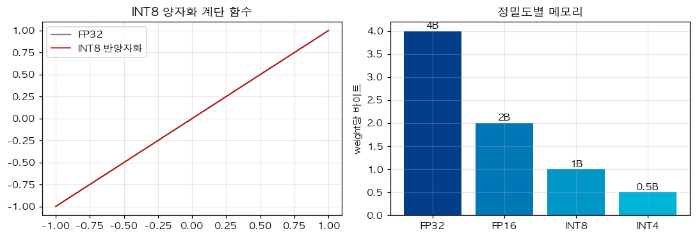

# 36. INT8 Quantized Linear — 8-bit 정수로 가중치 압축

> 📓 [원본 notebook](../solutions/36_int8_quantization_solution.ipynb) · 난이도 🟡

## 개념

FP32 대신 **INT8** 로 가중치를 저장하면 **메모리 1/4**, 대역폭 부담 1/4. 추론 가속의 기본 기법.

- Scale factor $s$: FP32 범위를 [-127, 127] 에 매핑
- 저장은 INT8, 계산 시 `s` 곱해 FP 복원 (또는 INT8 GEMM 직접 사용)
- **Per-row 양자화**: 행마다 $s$ 가 다름 (정밀도↑)



## 코드 line-by-line

```python
class Int8Linear(nn.Module):
    def __init__(self, weight, bias=None):
        super().__init__()
        scale = weight.abs().amax(dim=1, keepdim=True) / 127.0
        self.register_buffer('weight_int8',
            torch.round(weight / (scale + 1e-10)).clamp(-128, 127).to(torch.int8))
        self.register_buffer('scale', scale)
        self.bias = nn.Parameter(bias.clone()) if bias is not None else None
```

### Scale 계산

```python
scale = weight.abs().amax(dim=1, keepdim=True) / 127.0
```

- `weight.abs()` : 절대값
- `.amax(dim=1, keepdim=True)` : **행마다** 최대값 — shape `(out_features, 1)`
- `/ 127.0` : INT8 의 양수 범위 최대값으로 나눠 scale 계산

즉 각 row 에서 가장 큰 값이 INT8 의 127 에 매핑되도록. Row 별로 다른 scale → **per-row / per-channel** 양자화.

### 양자화

```python
torch.round(weight / (scale + 1e-10)).clamp(-128, 127).to(torch.int8)
```

1. `weight / scale` : [-127, 127] 대략적 범위로 scale
2. `.round()` : 정수로 반올림
3. `.clamp(-128, 127)` : 수치 오차로 범위 초과 방지
4. `.to(torch.int8)` : 진짜 INT8 타입 변환

### `register_buffer`

```python
self.register_buffer('weight_int8', ...)
self.register_buffer('scale', ...)
```

**중요**: `nn.Parameter` 가 아니라 **buffer**. 이유:

- 학습 대상 아님 (이미 양자화된 고정 값)
- 그러나 `model.to(device)`, `state_dict()` 등에 포함되어야 함
- Parameter 면 autograd 가 grad 추적하려 해 오류

### Bias

```python
self.bias = nn.Parameter(bias.clone()) if bias is not None else None
```

Bias 는 원래 FP32 유지 (크지 않아 양자화 이득 없음).

### Forward

```python
    def forward(self, x):
        w = self.weight_int8.float() * self.scale
        out = x @ w.T
        if self.bias is not None:
            out = out + self.bias
        return out
```

| 라인 | 설명 |
|------|------|
| `.float() * scale` | INT8 → FP32 **dequantize**. 원래 값의 근사 복원. |
| `x @ w.T` | 일반 Linear |

**실전**: dequantize 대신 **INT8 matmul** (e.g., `torch.ops.quantized` 나 bitsandbytes) 을 써야 진짜 속도 이득.

## 메모리 절감

| 타입 | 바이트 per weight |
|------|------------------|
| FP32 | 4 |
| FP16 / BF16 | 2 |
| INT8 | 1 |
| INT4 | 0.5 |

FP32 → INT8 = **4× 메모리 절감**, 대부분 task 에서 성능 거의 유지.

## 양자화 오차

```python
w = torch.randn(8, 4)
q = Int8Linear(w)
q.weight_int8.float() * q.scale   # w 와 매우 비슷 (최대 오차 ≈ scale)
```

각 원소의 양자화 오차는 $|e| \le s/2$ (반올림 오차). per-row scale 덕에 값 크기가 다른 row 도 정밀.

## Calibration 이 없는 이유

본 예제는 **weight-only quantization** (activation 은 FP). activation 도 양자화하면 calibration set 에서 분포를 추정해야 함 (GPTQ, AWQ 등의 주제).

## 한 걸음 더

- **INT4 quantization** (GPTQ, AWQ): 손실을 최소화하는 정교한 rounding
- **bitsandbytes 8bit**: 혼합 정밀도 (outlier 는 FP16, 나머지 INT8)
- **QLoRA**: 4-bit 양자화된 모델 위에 LoRA → 매우 큰 모델 단일 GPU 학습
