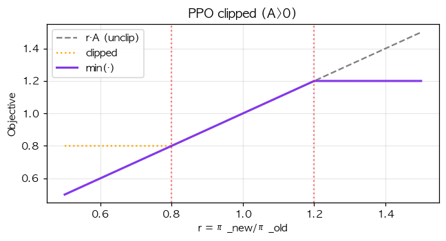
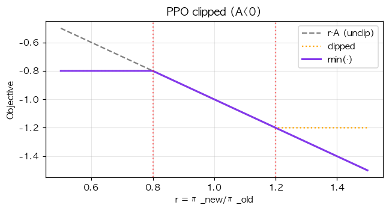

# 39. PPO Clipped Loss — RLHF 의 주력 알고리즘

> 📓 [원본 notebook](../solutions/39_ppo_loss_solution.ipynb) · 난이도 🔴

## 개념

**PPO (Proximal Policy Optimization)** 의 핵심: importance sampling 으로 off-policy 업데이트를 하되, 정책이 **너무 크게 변하는 것**을 clipping 으로 막음.

$$r_t(\theta) = \frac{\pi_\theta(a_t|s_t)}{\pi_{\theta_\text{old}}(a_t|s_t)}$$

$$\mathcal{L}^{\text{CLIP}} = -\mathbb{E}_t \left[\min\!\Big(r_t A_t, \; \text{clip}(r_t, 1-\epsilon, 1+\epsilon) A_t\Big)\right]$$

- $r_t$: 정책 비율 (old vs new)
- $A_t$: advantage
- $\epsilon$: clip range (보통 0.2)
- **min** 으로 "더 보수적인" 목적값 선택




## 코드 line-by-line

```python
def ppo_loss(new_logps, old_logps, advantages, clip_ratio=0.2):
    old_logps_detached = old_logps.detach()
    adv_detached = advantages.detach()

    ratios = torch.exp(new_logps - old_logps_detached)

    unclipped = ratios * adv_detached
    clipped = torch.clamp(ratios, 1.0 - clip_ratio, 1.0 + clip_ratio) * adv_detached

    return -torch.min(unclipped, clipped).mean()
```

### Detach

```python
old_logps_detached = old_logps.detach()
adv_detached = advantages.detach()
```

- `old_logps` : 이전 policy 의 log-prob. **상수 취급** — grad 안 흐름.
- `advantages` : 이미 계산된 값. 상수.
- gradient 는 오직 `new_logps` 를 통해 현재 policy 로 흐름.

### 비율 계산

```python
ratios = torch.exp(new_logps - old_logps_detached)
```

log-space 에서 빼고 exp — 수치 안정. $\exp(\log p_{new} - \log p_{old}) = p_{new}/p_{old}$.

### Unclipped / clipped

```python
unclipped = ratios * adv                              # r · A
clipped = clamp(ratios, 1-ε, 1+ε) * adv               # clip(r, 1±ε) · A
```

### min + negate

```python
return -torch.min(unclipped, clipped).mean()
```

**min** 을 취하는 이유:

- **A > 0** (좋은 action): $r$ 을 올리고 싶지만 `1+ε` 초과하면 clipped 이 작아짐 → min 이 clipped 선택 → **상한 제동**
- **A < 0** (나쁜 action): $r$ 을 내리고 싶지만 `1-ε` 미만 되면 clipped 이 덜 작음 → min 이 unclipped 선택 → **제한 없이 감소** (단조 improvement 유도)

결과: 정책이 너무 과격하게 변하는 것만 막음. **trust region** 효과.

## 그래프 해석

`A > 0` 경우 (위 `ppo_pos.png`):
- `r < 1`: unclipped < clipped (둘 다 양수, r 이 작으니 목적값 감소)
- `r ≈ 1`: 목적값 ≈ A
- `r > 1+ε`: clipped 고정 (평평), 정책 과도 변화 막음

`A < 0` 경우 (위 `ppo_neg.png`):
- 대칭적으로 반대 효과

## 검증

```python
new_logps = torch.tensor([0.0, -0.2, -0.4, -0.6])
old_logps = torch.tensor([0.0, -0.1, -0.5, -0.5])
advantages = torch.tensor([1.0, -1.0, 0.5, -0.5])
ppo_loss(new_logps, old_logps, advantages, 0.2)
# loss: scalar
```

## PPO 가 RLHF 에서 중요한 이유

- Policy 만 변화시키되 **KL constraint** 가 clipping 으로 간접 구현
- Off-policy 샘플 재활용 → sample efficiency
- InstructGPT, ChatGPT, GPT-4 학습 방식의 뼈대

## 한 걸음 더

- Full RLHF: PPO + reward model + KL penalty to SFT
- **GRPO** ([38번](38_grpo_loss.md)): value network 제거 버전
- **DPO** ([37번](37_dpo_loss.md)): PPO 를 preference loss 로 교체
- 실전에서는 `c_1 · value_loss + c_2 · entropy_bonus` 가 추가됨
