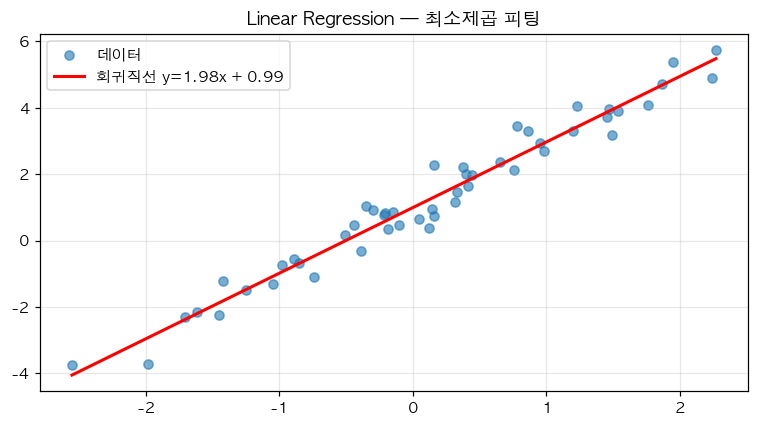

# 40. Linear Regression — 세 가지 관점으로 푸는 첫 ML 문제

> 📓 [원본 notebook](../solutions/40_linear_regression_solution.ipynb) · 난이도 🟡

## 개념

선형회귀: 입력 $X \in \mathbb{R}^{N \times D}$ 로부터 출력 $y \in \mathbb{R}^N$ 을 예측하는 $w, b$ 찾기.

$$\hat{y} = Xw + b, \quad \mathcal{L} = \frac{1}{N} \|\hat{y} - y\|^2$$

세 가지 접근:
1. **Closed-form (normal equation)** — 수학적 해
2. **Gradient descent (수동)** — 직접 미분해서 업데이트
3. **nn.Linear + autograd** — 프레임워크 사용



## 1. Closed-form

```python
def closed_form(self, X, y):
    N, D = X.shape
    X_aug = torch.cat([X, torch.ones(N, 1)], dim=1)
    theta = torch.linalg.lstsq(X_aug, y).solution
    w = theta[:D]
    b = theta[D]
    return w.detach(), b.detach()
```

| 라인 | 설명 |
|------|------|
| `X_aug = cat([X, ones], 1)` | 끝에 **1 열 추가** → bias 를 extra weight 처럼 처리. `(N, D+1)`. |
| `torch.linalg.lstsq(X_aug, y)` | 최소제곱 해. 내부적으로 $X^\top X \theta = X^\top y$ 를 QR/SVD 로 안정적으로. |
| `.solution[:D]` | 원래 특성의 가중치 $w$ |
| `.solution[D]` | bias $b$ |

**장점**: 정확한 해 한 번에.
**단점**: D 가 크면 $O(D^3)$ 역행렬 계산, 비정규화 문제.

## 2. Gradient descent (수동)

```python
def gradient_descent(self, X, y, lr=0.01, steps=1000):
    N, D = X.shape
    w = torch.zeros(D)
    b = torch.tensor(0.0)

    for _ in range(steps):
        pred = X @ w + b
        error = pred - y
        grad_w = (2.0 / N) * (X.T @ error)
        grad_b = (2.0 / N) * error.sum()
        w = w - lr * grad_w
        b = b - lr * grad_b

    return w, b
```

| 라인 | 설명 |
|------|------|
| `pred = X @ w + b` | 예측 |
| `error = pred - y` | 잔차 |
| `grad_w = (2/N) X.T @ error` | MSE 미분: $\frac{\partial \mathcal{L}}{\partial w} = \frac{2}{N} X^\top (Xw - y)$ |
| `grad_b = (2/N) error.sum()` | $\frac{\partial \mathcal{L}}{\partial b} = \frac{2}{N} \sum (\hat{y}_i - y_i)$ |
| `w -= lr · grad_w` | gradient descent step |

**학습의 핵심 직관**을 드러내는 방식. autograd 없이도 동작.

## 3. nn.Linear + autograd

```python
def nn_linear(self, X, y, lr=0.01, steps=1000):
    N, D = X.shape
    layer = nn.Linear(D, 1)
    optimizer = torch.optim.SGD(layer.parameters(), lr=lr)
    loss_fn = nn.MSELoss()

    for _ in range(steps):
        optimizer.zero_grad()
        pred = layer(X).squeeze(-1)
        loss = loss_fn(pred, y)
        loss.backward()
        optimizer.step()

    w = layer.weight.data.squeeze(0)
    b = layer.bias.data.squeeze(0)
    return w, b
```

| 라인 | 설명 |
|------|------|
| `nn.Linear(D, 1)` | D → 1 linear. `.weight` shape `(1, D)`, `.bias` shape `(1,)` |
| `optimizer.zero_grad()` | 이전 grad 초기화 |
| `pred.squeeze(-1)` | `(N, 1) → (N,)` |
| `loss.backward()` | autograd 로 grad 자동 계산 |
| `optimizer.step()` | SGD 업데이트 |

**현실적 방식**. 수동 gradient 를 쓸 일은 드묾.

## 세 방법 비교

```python
True w=[2.0, -1.0, 0.5] b=3.0

Closed-form  w=[2.00, -1.00, 0.50]  b=3.00    ← 정확
Grad Descent w=[1.99, -1.00, 0.50]  b=3.00    ← 근사 수렴
nn.Linear    w=[1.99, -1.00, 0.50]  b=3.00    ← 근사 수렴
```

데이터가 선형 + 적당한 noise 면 모두 동일한 해에 수렴.

## 왜 세 가지 모두 배우는가

- Closed-form: 수학적 직관, 작은 선형 문제에 유용
- Manual GD: 딥러닝의 근본 — autograd 전에 어떻게 grad 를 계산했는지
- nn.Linear: 실제 코드 작성 방식

## 한 걸음 더

- Ridge regression: `X^T X + λI` 으로 정규화 (수치 안정 + 과적합 방지)
- Lasso: L1 정규화 → sparse 해
- 비선형 확장: kernel method, neural network
- Feature engineering: 비선형 변수 추가 → 여전히 "linear in weights"
